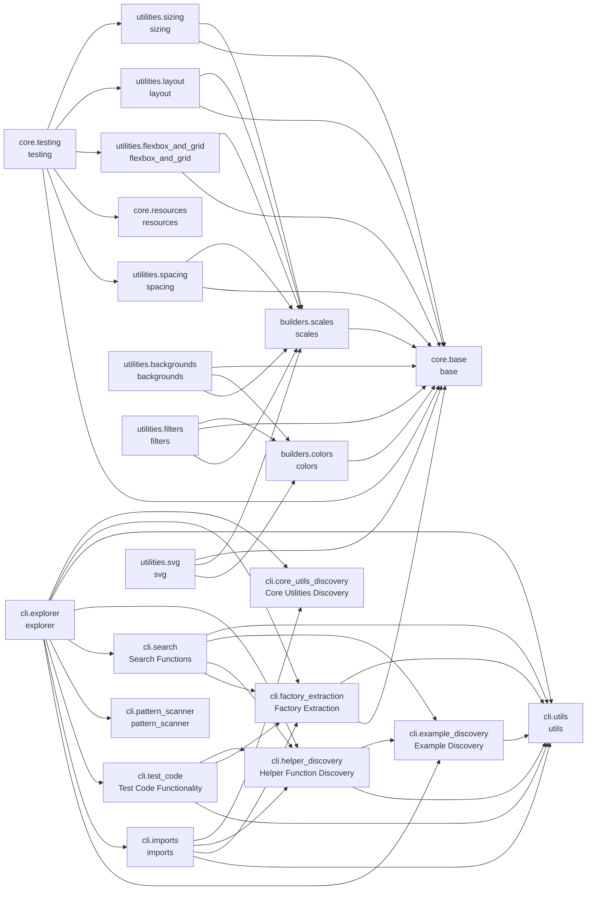

# cjm-fasthtml-tailwind


<!-- WARNING: THIS FILE WAS AUTOGENERATED! DO NOT EDIT! -->

## Install

``` bash
pip install cjm-fasthtml-tailwind
```

## Project Structure

    nbs/
    ├── builders/ (2)
    │   ├── colors.ipynb  # Color system builders for Tailwind CSS utilities
    │   └── scales.ipynb  # Numeric and named scale builders for Tailwind CSS utilities
    ├── cli/ (10)
    │   ├── core_utils_discovery.ipynb  # Functions to discover and display core utility functions like combine_classes:
    │   ├── example_discovery.ipynb     # Functions to discover and extract test example functions:
    │   ├── explorer.ipynb              # CLI tool for API exploration of cjm-fasthtml-tailwind utilities
    │   ├── factory_extraction.ipynb    # Functions to extract BaseFactory instances from modules:
    │   ├── helper_discovery.ipynb      # Functions to discover and extract helper functions:
    │   ├── imports.ipynb               # Functions for getting import statements.
    │   ├── pattern_scanner.ipynb       # Scan Python code for replaceable CSS class patterns
    │   ├── search.ipynb                # Functions to search across all library components:
    │   ├── test_code.ipynb             # Functions to test code snippets using the library:
    │   └── utils.ipynb                 # Utility functions for CLI tools
    ├── core/ (3)
    │   ├── base.ipynb       # Base classes, types, and protocols for Tailwind CSS abstractions
    │   ├── resources.ipynb  # CDN resources and headers for Tailwind CSS
    │   └── testing.ipynb    # Standardized test page creation for Jupyter notebooks with FastHTML
    └── utilities/ (7)
        ├── backgrounds.ipynb       # Background utilities for Tailwind CSS
        ├── filters.ipynb           # Filter utilities for Tailwind CSS
        ├── flexbox_and_grid.ipynb  # Flexbox and CSS Grid utilities for Tailwind CSS
        ├── layout.ipynb            # Display, position, overflow, z-index and other layout utilities for Tailwind CSS
        ├── sizing.ipynb            # Width, height, and min/max sizing utilities for Tailwind CSS
        ├── spacing.ipynb           # Padding and margin utilities for Tailwind CSS
        └── svg.ipynb               # SVG utilities for Tailwind CSS

Total: 22 notebooks across 4 directories

## Module Dependencies



*50 cross-module dependencies detected*

## CLI Reference

### `cjm-tailwind-explore` Command

    usage: cjm-tailwind-explore [-h]
                                {modules,factories,factory,examples,example,helpers,helper,search,test-code,core-utils,core-util,imports,scan}
                                ...

    cjm-fasthtml-tailwind CLI Explorer

    This tool helps you explore the cjm-fasthtml-tailwind library, which provides:
    - Python-native Tailwind CSS v4 utility class builders for FastHTML projects
    - Type-safe, dynamic CSS class generation without hardcoded strings
    - Comprehensive utility factories (bg, bg_attachment, bg_clip, bg_conic, etc.)
    - Helper functions for common patterns
    - Full integration with FastHTML components

    Purpose: This CLI tool enables autonomous exploration of the library's API by:
    - Discovering all available utility modules and their documentation
    - Listing factory instances with their built-in documentation
    - Showing usage examples from test functions
    - Providing source code for helper functions
    - Searching across all library components
    - Testing code snippets with automatic imports
    - Generating recommended import statements
    - Scanning existing code for replaceable CSS patterns

    All information is dynamically extracted from the library itself - nothing is hardcoded.

    positional arguments:
      {modules,factories,factory,examples,example,helpers,helper,search,test-code,core-utils,core-util,imports,scan}
                            Available commands
        modules             List all utility modules
        factories           List factories
        factory             Show detailed info for a specific factory
        examples            Show usage examples
        example             Show source code for a specific example
        helpers             Show helper functions
        helper              Show source code for a specific helper
        search              Search across all library components
        test-code           Test code snippets using the library
        core-utils          List core utility functions
        core-util           Show source code for a core utility
        imports             Show recommended import statements
        scan                Scan code for replaceable CSS patterns

    options:
      -h, --help            show this help message and exit

    Getting Started:
      1. List all modules:     cjm-tailwind-explore modules
      2. View factories:       cjm-tailwind-explore factories
      3. Search for patterns:  cjm-tailwind-explore search <query>
      4. Test code:           cjm-tailwind-explore test-code "<code>"
      5. Get imports:         cjm-tailwind-explore imports
      6. Scan existing code:  cjm-tailwind-explore scan <file>

    Exploration Workflow:
      - Start with 'modules' to see available utility categories
      - Use 'factories -m <module>' to explore specific modules
      - Use 'factory <module> <name>' for detailed factory information
      - Use 'examples' to see test-based usage patterns
      - Use 'search' to find specific functionality
      - Use 'test-code' to verify your understanding
      - Use 'scan' to analyze existing code for migration opportunities

    Key Concepts:
      - Factories: Objects that generate CSS classes (e.g., bg, bg_attachment, bg_clip, bg_conic)
      - Modules: Categories of utilities (backgrounds, filters, flexbox_and_grid, etc.)
      - Examples: Test functions demonstrating usage patterns
      - Helpers: Convenience functions for common patterns

    Tips for Coding Assistants:
      - Use 'search --include-source' to find usage patterns in code
      - Use 'test-code' to validate generated code before using it
      - Use 'imports' to get all necessary import statements
      - Use 'scan' to identify replaceable hardcoded CSS classes
      - Factory names are intuitive: bg, bg_attachment, bg_clip, bg_conic
      - Combine utilities with combine_classes() function
      - All factories support method chaining and attribute access

    Example Usage Flow:
      cjm-tailwind-explore modules                    # See what's available
      cjm-tailwind-explore factories -m backgrounds       # Explore backgrounds utilities
      cjm-tailwind-explore factory backgrounds bg          # Learn about bg factory
      cjm-tailwind-explore example backgrounds arbitrary      # See usage examples
      cjm-tailwind-explore test-code 'print(str(bg("#123456")))'   # Test your understanding
      cjm-tailwind-explore scan app.py                # Analyze existing code

For detailed help on any command, use
`cjm-tailwind-explore <command> --help`.

## Module Overview

Detailed documentation for each module in the project:

### backgrounds (`backgrounds.ipynb`)

> Background utilities for Tailwind CSS

#### Import

``` python
from cjm_fasthtml_tailwind.utilities.backgrounds import (
    bg_attachment,
    bg_clip,
    bg,
    bg_none,
    bg_linear,
    bg_radial,
    bg_conic,
    from_color,
    via_color,
    to_color,
    bg_origin,
    bg_position,
    bg_repeat,
    bg_size,
    test_backgrounds_attachment_examples,
    test_backgrounds_clip_examples,
    test_backgrounds_color_examples,
    test_backgrounds_opacity_examples,
    GradientUtility,
    GradientFactory,
    GradientStopUtility,
    GradientStopFactory,
    test_backgrounds_gradient_examples,
    test_backgrounds_gradient_stops_examples,
    test_backgrounds_gradient_composition_examples,
    test_backgrounds_origin_examples,
    test_backgrounds_position_examples,
    test_backgrounds_repeat_examples,
    test_backgrounds_size_examples,
    test_backgrounds_arbitrary_examples,
    test_backgrounds_practical_examples,
    test_backgrounds_factory_documentation
)
```

#### Functions

``` python
def test_backgrounds_attachment_examples()
    "Test background attachment utilities."
```

``` python
def test_backgrounds_clip_examples()
    "Test background clip utilities."
```

``` python
def test_backgrounds_color_examples()
    "Test background color utilities with various color values."
```

``` python
def test_backgrounds_opacity_examples()
    "Test background colors with opacity modifiers."
```

``` python
def test_backgrounds_gradient_examples()
    "Test gradient background utilities."
```

``` python
def test_backgrounds_gradient_stops_examples()
    "Test gradient color stop utilities."
```

``` python
def test_backgrounds_gradient_composition_examples()
    "Test composing gradient backgrounds with color stops."
```

``` python
def test_backgrounds_origin_examples()
    "Test background origin utilities."
```

``` python
def test_backgrounds_position_examples()
    "Test background position utilities."
```

``` python
def test_backgrounds_repeat_examples()
    "Test background repeat utilities."
```

``` python
def test_backgrounds_size_examples()
    "Test background size utilities."
```

``` python
def test_backgrounds_arbitrary_examples()
    "Test background utilities with arbitrary values."
```

``` python
def test_backgrounds_practical_examples()
    "Test background utilities in practical FastHTML component examples."
```

``` python
def test_backgrounds_factory_documentation()
    "Test that background factories have accessible documentation."
```

#### Classes

``` python
class GradientUtility:
    def __init__(
        self,
        gradient_type: str,  # Type of gradient (linear, radial, conic)
        value: Optional[Union[str, int]] = None,  # Direction, angle, or custom value
        negative: bool = False  # Whether to negate the angle
    )
    "Utility class for gradient backgrounds with angle support."
    
    def __init__(
            self,
            gradient_type: str,  # Type of gradient (linear, radial, conic)
            value: Optional[Union[str, int]] = None,  # Direction, angle, or custom value
            negative: bool = False  # Whether to negate the angle
        )
        "Initialize gradient utility."
```

``` python
class GradientFactory:
    def __init__(
        self,
        gradient_type: str,  # Type of gradient (linear, radial, conic)
        doc: Optional[str] = None  # Documentation
    )
    "Factory for gradient utilities with angle and direction support."
    
    def __init__(
            self,
            gradient_type: str,  # Type of gradient (linear, radial, conic)
            doc: Optional[str] = None  # Documentation
        )
        "Initialize gradient factory."
    
    def get_info(
            self
        ) -> Dict[str, Any]:  # Factory information
        "Get information about this gradient factory."
```

``` python
class GradientStopUtility:
    def __init__(
        self,
        stop_type: str,  # Type of stop (from, via, to)
        value: Optional[Union[ColorValue, str, int]] = None,  # Color or percentage
        is_position: bool = False  # Whether this is a position value
    )
    "Utility class for gradient color stops with percentage support."
    
    def __init__(
            self,
            stop_type: str,  # Type of stop (from, via, to)
            value: Optional[Union[ColorValue, str, int]] = None,  # Color or percentage
            is_position: bool = False  # Whether this is a position value
        )
        "Initialize gradient stop utility."
```

``` python
class GradientStopFactory:
    def __init__(
        self,
        stop_type: str,  # Type of stop (from, via, to)
        doc: Optional[str] = None  # Documentation
    )
    "Enhanced factory for gradient color stops with percentage support."
    
    def __init__(
            self,
            stop_type: str,  # Type of stop (from, via, to)
            doc: Optional[str] = None  # Documentation
        )
        "Initialize gradient stop factory."
```

#### Variables

``` python
bg  # The background color factory
bg_none  # Remove background image
```

### base (`base.ipynb`)

> Base classes, types, and protocols for Tailwind CSS abstractions

#### Import

``` python
from cjm_fasthtml_tailwind.core.base import (
    TailwindScale,
    TailwindFraction,
    TailwindArbitrary,
    TailwindCustomProperty,
    TailwindValue,
    CONTAINER_SCALES,
    BREAKPOINTS,
    STATE_MODIFIERS,
    T,
    DIRECTIONS,
    is_numeric_scale,
    is_fraction,
    is_custom_property,
    is_arbitrary_value,
    TailwindBuilder,
    BaseUtility,
    StandardUtility,
    NamedScale,
    Breakpoint,
    BaseFactory,
    UtilityFactory,
    combine_classes,
    SingleValueFactory,
    Direction,
    DirectionalUtility,
    NegativeableUtility
)
```

#### Functions

``` python
def is_numeric_scale(
    value: Any  # The value to check - can be int, float, or string
) -> bool:  # True if the value is a valid numeric scale, False otherwise
    "Check if value is a valid numeric scale (int, float, or 'px')."
```

``` python
def is_fraction(
    value: Any  # The value to check for fraction format
) -> bool:  # True if the value is a valid fraction string, False otherwise
    "Check if value is a valid fraction string (e.g., '1/2', '3/4')."
```

``` python
def is_custom_property(
    value: Any  # The value to check for CSS custom property format
) -> bool:  # True if the value is a CSS custom property, False otherwise
    "Check if value is a CSS custom property (starts with --)."
```

``` python
def is_arbitrary_value(
    value: Any  # The value to check for arbitrary CSS value format
) -> bool:  # True if the value contains CSS units or calc(), False otherwise
    "Check if value is an arbitrary value (contains units or special chars)."
```

``` python
def combine_classes(
    *args: Union[str, BaseUtility, TailwindBuilder, BaseFactory, None]
) -> str:  # Space-separated class string
    "Combine multiple class builders or strings into a single class string."
```

#### Classes

``` python
@runtime_checkable
class TailwindBuilder(Protocol):
    "Protocol for all Tailwind utility builders."
    
    def build(
            self,
            *args,
            **kwargs
        ) -> str:  # The built CSS class string
        "Build and return the CSS class string."
```

``` python
class BaseUtility:
    def __init__(
        self,
        prefix: str  # The utility prefix (e.g., 'w' for width, 'p' for padding)
    )
    "Base class for all Tailwind utility builders."
    
    def __init__(
            self,
            prefix: str  # The utility prefix (e.g., 'w' for width, 'p' for padding)
        )
        "Initialize with a utility prefix."
    
    def build(
            self,
            value: Optional[TailwindValue] = None  # Optional value to override the stored value
        ) -> str:  # The built CSS class string
        "Build and return the CSS class string."
```

``` python
class StandardUtility(BaseUtility):
    "Standard utility class with common value formatting."
    
```

``` python
@dataclass
class NamedScale:
    "Represents a named scale with optional CSS variable."
    
    name: str
    var: Optional[str]
    comment: Optional[str]
    
    def format(
            self
        ) -> str:  # The name of the scale for use in CSS classes
        "Format as Tailwind class suffix."
```

``` python
@dataclass
class Breakpoint:
    "Responsive breakpoint definition."
    
    name: str
    min_width: Optional[str]
```

``` python
class BaseFactory:
    def __init__(
        self,
        doc: str  # Documentation string describing what this factory creates
    )
    "Base factory class with documentation support."
    
    def __init__(
            self,
            doc: str  # Documentation string describing what this factory creates
        )
        "Initialize with documentation string."
    
    def describe(
            self
        ) -> str:  # A formatted description of the factory
        "Return a formatted description of this factory."
    
    def get_info(
            self
        ) -> Dict[str, Any]:  # Dictionary with factory information
        "Get detailed information about this factory's options and valid inputs.

Should return a dictionary with keys like:
- 'description': Factory description
- 'valid_inputs': List/description of valid input values
- 'options': Available options or methods"
```

``` python
class UtilityFactory:
    def __init__(
        self,
        utility_class: type[T],  # The utility class to instantiate
        prefix: str,  # The prefix to use for the utilities
        doc: Optional[str] = None  # Optional documentation string
    )
    "Factory for creating utility instances with fluent API."
    
    def __init__(
            self,
            utility_class: type[T],  # The utility class to instantiate
            prefix: str,  # The prefix to use for the utilities
            doc: Optional[str] = None  # Optional documentation string
        )
        "Initialize factory with a utility class and prefix."
    
    def get_info(
            self
        ) -> Dict[str, Any]:  # Dictionary with factory information
        "Get information about this utility factory."
```

``` python
class SingleValueFactory:
    def __init__(
        self,
        value: str,  # The utility class string (e.g., "container")
        doc: str  # Documentation describing what this utility does
    )
    "Factory for a single utility class string with documentation."
    
    def __init__(
            self,
            value: str,  # The utility class string (e.g., "container")
            doc: str  # Documentation describing what this utility does
        )
        "Initialize with a value and documentation."
    
    def build(
            self
        ) -> str:  # The utility class string
        "Build and return the utility class string."
    
    def get_info(
            self
        ) -> Dict[str, Any]:  # Dictionary with factory information
        "Get information about this single-value factory."
```

``` python
@dataclass
class Direction:
    "Represents a directional variant."
    
    suffix: str
    css_suffix: str
```

``` python
class DirectionalUtility:
    def __init__(
        self,
        prefix: str,  # Base prefix (e.g., 'p' for padding)
        direction: Optional[str] = None  # Optional direction ('t', 'r', 'b', 'l', 'x', 'y')
    )
    "Base class for utilities with directional variants."
    
    def __init__(
            self,
            prefix: str,  # Base prefix (e.g., 'p' for padding)
            direction: Optional[str] = None  # Optional direction ('t', 'r', 'b', 'l', 'x', 'y')
        )
        "Initialize with prefix and optional direction."
```

``` python
class NegativeableUtility:
    def __init__(
        self,
        prefix: str,  # Base prefix
        negative: bool = False  # Whether this is a negative variant
    )
    "Utility class that supports negative values."
    
    def __init__(
            self,
            prefix: str,  # Base prefix
            negative: bool = False  # Whether this is a negative variant
        )
        "Initialize with prefix and negative flag."
```

#### Variables

``` python
TailwindScale  # Numeric scales like 1, 2.5, "px"
TailwindFraction  # Fractions like "1/2", "2/3"
TailwindArbitrary  # Arbitrary values like "123px", "10rem"
TailwindCustomProperty  # CSS custom properties like "--spacing-lg"
TailwindValue  # Union of all possible value types
CONTAINER_SCALES = [13 items]  # Common named scales used across utilities
BREAKPOINTS = {5 items}  # Common breakpoints
STATE_MODIFIERS = [39 items]  # Common state modifiers
T
DIRECTIONS = {6 items}  # Common directions
```

### colors (`colors.ipynb`)

> Color system builders for Tailwind CSS utilities

#### Import

``` python
from cjm_fasthtml_tailwind.builders.colors import (
    SPECIAL_COLORS,
    ColorSpec,
    ColorValue,
    ColorFamily,
    ColorShade,
    is_valid_color_family,
    is_valid_shade,
    parse_color_spec,
    ColoredUtility,
    ColoredFactory,
    ColorFamilyProxy,
    test_colors_enum_examples,
    test_colors_validation_examples,
    test_colors_factory_examples,
    test_colors_opacity_examples,
    test_colors_arbitrary_examples,
    test_colors_proxy_examples,
    test_colors_multiple_utilities_examples,
    test_colors_practical_usage_examples,
    get_all_color_families,
    get_all_shades,
    get_all_color_specs,
    test_colors_factory_documentation
)
```

#### Functions

``` python
def is_valid_color_family(
    value: str  # The value to check
) -> bool:  # True if value is a valid color family
    "Check if a value is a valid Tailwind color family."
```

``` python
def is_valid_shade(
    value: str  # The value to check
) -> bool:  # True if value is a valid shade
    "Check if a value is a valid Tailwind shade."
```

``` python
def parse_color_spec(
    value: ColorSpec  # The color specification to parse
) -> tuple[str, Optional[str]]:  # Tuple of (color_family, shade) or (special_color, None)
    """
    Parse a color specification into family and shade.
    
    Examples:
    - "red-500" -> ("red", "500")
    - ("red", "500") -> ("red", "500")
    - "transparent" -> ("transparent", None)
    """
```

``` python
def test_colors_enum_examples()
    "Test color family and shade enums."
```

``` python
def test_colors_validation_examples()
    "Test color validation functions."
```

``` python
def test_colors_factory_examples()
    "Test ColoredFactory with various color specifications."
```

``` python
def test_colors_opacity_examples()
    "Test opacity modifiers with color utilities."
```

``` python
def test_colors_arbitrary_examples()
    "Test arbitrary color values and custom properties."
```

``` python
def test_colors_proxy_examples()
    "Test ColorFamilyProxy for dot notation access."
```

``` python
def test_colors_multiple_utilities_examples()
    "Test color system with multiple utility types."
```

``` python
def test_colors_practical_usage_examples()
    "Test practical usage patterns with FastHTML components."
```

``` python
def get_all_color_families() -> List[str]
    "Get list of all Tailwind color family names."
```

``` python
def get_all_shades() -> List[str]
    "Get list of all Tailwind shade values."
```

``` python
def get_all_color_specs() -> List[str]:
    """Get list of all valid color-shade combinations."""
    specs = []
    for family in ColorFamily
    "Get list of all valid color-shade combinations."
```

``` python
def test_colors_factory_documentation()
    "Test that color factories have proper documentation."
```

#### Classes

``` python
class ColorFamily(str, Enum):
    "Tailwind CSS color families."
```

``` python
class ColorShade(str, Enum):
    "Tailwind CSS color shade values."
```

``` python
class ColoredUtility:
    def __init__(
        self,
        prefix: str,  # The utility prefix (e.g., 'bg', 'text', 'border')
        color: Optional[ColorValue] = None,  # The color value
        opacity: Optional[Union[int, str]] = None  # Optional opacity value (0-100 or arbitrary)
    )
    "Utility class with color and opacity support."
    
    def __init__(
            self,
            prefix: str,  # The utility prefix (e.g., 'bg', 'text', 'border')
            color: Optional[ColorValue] = None,  # The color value
            opacity: Optional[Union[int, str]] = None  # Optional opacity value (0-100 or arbitrary)
        )
        "Initialize with prefix, optional color, and optional opacity."
    
    def opacity(
            self,
            value: Union[int, str]  # Opacity value (0-100 or arbitrary)
        ) -> 'ColoredUtility':  # A new instance with opacity set
        "Return a new ColoredUtility instance with opacity value."
```

``` python
class ColoredFactory:
    def __init__(
        self,
        prefix: str,  # The utility prefix (e.g., 'bg', 'text', 'border')
        doc: Optional[str] = None  # Optional documentation string
    )
    "Factory for creating color-based utilities."
    
    def __init__(
            self,
            prefix: str,  # The utility prefix (e.g., 'bg', 'text', 'border')
            doc: Optional[str] = None  # Optional documentation string
        )
        "Initialize factory with prefix and documentation."
    
    def get_info(
            self
        ) -> Dict[str, Any]:  # Dictionary with factory information
        "Get detailed information about this color factory."
```

``` python
class ColorFamilyProxy:
    def __init__(
        self,
        prefix: str,  # The utility prefix
        color_family: str  # The color family name
    )
    "Proxy for accessing color shades via dot notation."
    
    def __init__(
            self,
            prefix: str,  # The utility prefix
            color_family: str  # The color family name
        )
        "Initialize with prefix and color family."
```

#### Variables

``` python
SPECIAL_COLORS = {5 items}
```

### Core Utilities Discovery (`core_utils_discovery.ipynb`)

> Functions to discover and display core utility functions like
> combine_classes:

#### Import

``` python
from cjm_fasthtml_tailwind.cli.core_utils_discovery import (
    CoreUtilityInfo,
    get_core_utilities
)
```

#### Functions

``` python
def get_core_utilities(
) -> List[CoreUtilityInfo]:  # TODO: Add return description
    "Get information about core utility functions."
```

#### Classes

``` python
@dataclass
class CoreUtilityInfo:
    "Information about a core utility function."
    
    name: str  # Function name
    module: str  # Module path (e.g., 'cjm_fasthtml_tailwind.core.base')
    function: Any  # The actual function object
    signature: str  # Function signature
    docstring: str  # Function docstring
    source: str  # Source code
    import_statement: str  # How to import this utility
```

### Example Discovery (`example_discovery.ipynb`)

> Functions to discover and extract test example functions:

#### Import

``` python
from cjm_fasthtml_tailwind.cli.example_discovery import (
    ExampleInfo,
    extract_test_examples_from_module,
    list_all_examples,
    list_module_examples,
    get_example_by_name
)
```

#### Functions

``` python
def extract_test_examples_from_module(
    module: Any,  # The module to extract test examples from
    module_name: str  # The name of the module
) -> List[ExampleInfo]:  # List of ExampleInfo objects
    "Extract all test example functions from a module."
```

``` python
def list_all_examples(
) -> Dict[str, List[ExampleInfo]]:  # Dictionary mapping module names to their examples
    "List all test example functions across all utility modules."
```

``` python
def list_module_examples(
    module_name: str  # Name of the module to inspect
) -> List[ExampleInfo]:  # List of ExampleInfo objects
    "List all test example functions in a specific utility module."
```

``` python
def get_example_by_name(
    module_name: str,  # Name of the module
    feature: str  # Feature name (e.g., 'basic', 'directional')
) -> Optional[ExampleInfo]:  # ExampleInfo object or None if not found
    "Get a specific example by module name and feature."
```

#### Classes

``` python
@dataclass
class ExampleInfo:
    "Information about a discovered test example function."
    
    name: str  # Function name (e.g., 'test_spacing_basic_examples')
    module_name: str  # Module where it was found (e.g., 'spacing')
    feature: str  # Feature being demonstrated (e.g., 'basic')
    function: Any  # The actual function object
    source: str  # Source code of the function
    docstring: str  # Docstring of the function
```

### explorer (`explorer.ipynb`)

> CLI tool for API exploration of cjm-fasthtml-tailwind utilities

#### Import

``` python
from cjm_fasthtml_tailwind.cli.explorer import (
    display_modules,
    display_module_factories,
    display_all_factories,
    display_module_examples,
    display_all_examples,
    display_example_source,
    display_module_helpers,
    display_helper_source,
    display_all_helpers,
    display_factory_info,
    display_search_results,
    display_core_utility_source,
    display_core_utilities,
    display_imports,
    display_test_code_result,
    get_example_modules,
    get_example_factories,
    get_example_features,
    get_example_helpers,
    get_example_core_utils,
    get_combine_classes_example,
    get_example_test_code,
    add_modules_parser,
    add_factories_parser,
    add_factory_parser,
    add_examples_parser,
    add_example_parser,
    add_helpers_parser,
    add_helper_parser,
    add_search_parser,
    add_test_code_parser,
    add_core_utils_parser,
    add_core_util_parser,
    add_imports_parser,
    add_scan_parser,
    dispatch_command,
    handle_search_command,
    handle_test_code_command,
    handle_scan_command,
    setup_argument_parser,
    main
)
```

#### Functions

``` python
def display_modules(
): # TODO: Add type hint
    "Display all available utility modules with their documentation."
```

``` python
def display_module_factories(
    module_name: str  # TODO: Add description
): # TODO: Add type hint
    "Display all factories in a specific module."
```

``` python
def display_all_factories(
): # TODO: Add type hint
    "Display all factories across all modules."
```

``` python
def display_module_examples(
    module_name: str  # TODO: Add description
): # TODO: Add type hint
    "Display all usage examples in a specific module."
```

``` python
def display_all_examples(
): # TODO: Add type hint
    "Display all usage examples across all modules."
```

``` python
def display_example_source(
    module_name: str,  # TODO: Add description
    feature: str  # TODO: Add description
): # TODO: Add type hint
    "Display the source code of a specific example function."
```

``` python
def display_module_helpers(
    module_name: str  # TODO: Add description
): # TODO: Add type hint
    "Display helper functions available in a specific module."
```

``` python
def display_helper_source(
    module_name: str,  # TODO: Add description
    helper_name: str  # TODO: Add description
): # TODO: Add type hint
    "Display the source code of a specific helper function."
```

``` python
def display_all_helpers(
): # TODO: Add type hint
    "Display all helper functions across all modules."
```

``` python
def display_factory_info(
    module_name: str,  # TODO: Add description
    factory_name: str  # TODO: Add description
): # TODO: Add type hint
    "Display detailed information about a specific factory."
```

``` python
def display_search_results(
    results: List[SearchResult],  # TODO: Add description
    query: str  # TODO: Add description
): # TODO: Add type hint
    "Display search results in a formatted way."
```

``` python
def display_core_utility_source(
    util_name: str  # TODO: Add description
): # TODO: Add type hint
    "Display the source code of a specific core utility function."
```

``` python
def display_core_utilities(
): # TODO: Add type hint
    "Display all core utility functions."
```

``` python
def display_imports(
    modules: Optional[List[str]] = None  # TODO: Add description
): # TODO: Add type hint
    "Display recommended import statements."
```

``` python
def display_test_code_result(
    success: bool,  # TODO: Add description
    stdout: str,  # TODO: Add description
    stderr: str,  # TODO: Add description
    code: str  # TODO: Add description
): # TODO: Add type hint
    "Display the results of test code execution."
```

``` python
def get_example_modules(
    limit: int = 2  # TODO: Add description
) -> str:  # TODO: Add return description
    "Get example module names dynamically."
```

``` python
def get_example_factories(
    module_name: str = None,  # TODO: Add description
    limit: int = 4  # TODO: Add description
) -> str:  # TODO: Add return description
    "Get example factory names dynamically."
```

``` python
def get_example_features(
    module_name: str = None,  # TODO: Add description
    limit: int = 3  # TODO: Add description
) -> str:  # TODO: Add return description
    "Get example feature names dynamically."
```

``` python
def get_example_helpers(
    module_name: str = None,  # TODO: Add description
    limit: int = 2  # TODO: Add description
) -> str:  # TODO: Add return description
    "Get example helper function names dynamically."
```

``` python
def get_example_core_utils(
    limit: int = 2  # TODO: Add description
) -> str:  # TODO: Add return description
    "Get example core utility names dynamically."
```

``` python
def get_combine_classes_example(
) -> str:  # TODO: Add return description
    "Get a dynamic example of combine_classes usage."
```

``` python
def get_example_test_code(
    limit_chars: int = 50  # TODO: Add description
) -> str:  # TODO: Add return description
    "Get an actual code example from test functions."
```

``` python
def add_modules_parser(
    subparsers  # TODO: Add type hint and description
): # TODO: Add type hint
    "Add the 'modules' command parser."
```

``` python
def add_factories_parser(
    subparsers  # TODO: Add type hint and description
): # TODO: Add type hint
    "Add the 'factories' command parser."
```

``` python
def add_factory_parser(
    subparsers  # TODO: Add type hint and description
): # TODO: Add type hint
    "Add the 'factory' command parser."
```

``` python
def add_examples_parser(
    subparsers  # TODO: Add type hint and description
): # TODO: Add type hint
    "Add the 'examples' command parser."
```

``` python
def add_example_parser(
    subparsers  # TODO: Add type hint and description
): # TODO: Add type hint
    "Add the 'example' command parser."
```

``` python
def add_helpers_parser(
    subparsers  # TODO: Add type hint and description
): # TODO: Add type hint
    "Add the 'helpers' command parser."
```

``` python
def add_helper_parser(
    subparsers  # TODO: Add type hint and description
): # TODO: Add type hint
    "Add the 'helper' command parser."
```

``` python
def add_search_parser(
    subparsers  # TODO: Add type hint and description
): # TODO: Add type hint
    "Add the 'search' command parser."
```

``` python
def add_test_code_parser(
    subparsers  # TODO: Add type hint and description
): # TODO: Add type hint
    "Add the 'test-code' command parser."
```

``` python
def add_core_utils_parser(
    subparsers  # TODO: Add type hint and description
): # TODO: Add type hint
    "Add the 'core-utils' command parser."
```

``` python
def add_core_util_parser(
    subparsers  # TODO: Add type hint and description
): # TODO: Add type hint
    "Add the 'core-util' command parser."
```

``` python
def add_imports_parser(
    subparsers  # TODO: Add type hint and description
): # TODO: Add type hint
    "Add the 'imports' command parser."
```

``` python
def add_scan_parser(
    subparsers  # TODO: Add type hint and description
): # TODO: Add type hint
    "Add the 'scan' command parser."
```

``` python
def dispatch_command(
    args  # TODO: Add type hint and description
): # TODO: Add type hint
    "Dispatch the parsed arguments to the appropriate handler."
```

``` python
def handle_search_command(
    args  # TODO: Add type hint and description
): # TODO: Add type hint
    "Handle the search command."
```

``` python
def handle_test_code_command(
    args  # TODO: Add type hint and description
): # TODO: Add type hint
    "Handle the test-code command."
```

``` python
def handle_scan_command(
    args  # TODO: Add type hint and description
): # TODO: Add type hint
    "Handle the scan command."
```

``` python
def setup_argument_parser(
): # TODO: Add type hint
    "Set up the main argument parser with all subcommands."
```

``` python
def main(
): # TODO: Add type hint
    "CLI entry point for exploring cjm-fasthtml-tailwind utilities."
```

### Factory Extraction (`factory_extraction.ipynb`)

> Functions to extract BaseFactory instances from modules:

#### Import

``` python
from cjm_fasthtml_tailwind.cli.factory_extraction import (
    FactoryInfo,
    extract_factories_from_module,
    list_all_factories,
    list_module_factories,
    get_factory_by_name
)
```

#### Functions

``` python
def extract_factories_from_module(
    module: Any,  # The module to extract factories from
    module_name: str  # The name of the module
) -> List[FactoryInfo]:  # List of FactoryInfo objects
    "Extract all BaseFactory instances from a module."
```

``` python
def list_all_factories(
) -> Dict[str, List[FactoryInfo]]:  # Dictionary mapping module names to their factories
    "List all factory instances across all utility modules."
```

``` python
def list_module_factories(
    module_name: str  # Name of the module to inspect (e.g., 'spacing', 'sizing')
) -> List[FactoryInfo]:  # List of FactoryInfo objects for the module
    "List all factory instances in a specific utility module."
```

``` python
def get_factory_by_name(
    module_name: str,  # Name of the module
    factory_name: str  # Name of the factory (e.g., 'p', 'w', 'flex')
) -> Optional[FactoryInfo]:  # FactoryInfo object or None if not found
    "Get a specific factory by module name and factory name."
```

#### Classes

``` python
@dataclass
class FactoryInfo:
    "Information about a discovered factory instance."
    
    name: str  # Factory variable name (e.g., 'p', 'w', 'flex')
    factory: BaseFactory  # The actual factory instance
    doc: str  # Documentation from the factory
    module_name: str  # Module where it was found
```

### filters (`filters.ipynb`)

> Filter utilities for Tailwind CSS

#### Import

``` python
from cjm_fasthtml_tailwind.utilities.filters import (
    filter_none,
    BLUR_SCALES,
    blur,
    BRIGHTNESS_VALUES,
    brightness_config,
    brightness,
    CONTRAST_VALUES,
    contrast,
    DROP_SHADOW_SCALES,
    drop_shadow,
    drop_shadow_color,
    grayscale,
    HUE_ROTATE_VALUES,
    hue_rotate_config,
    hue_rotate,
    invert,
    SATURATE_VALUES,
    saturate,
    sepia,
    backdrop_filter_none,
    backdrop_blur,
    backdrop_brightness,
    backdrop_contrast,
    backdrop_saturate,
    backdrop_opacity,
    backdrop_grayscale,
    backdrop_sepia,
    backdrop_hue_rotate,
    test_filters_control_examples,
    BlurScale,
    test_filters_blur_examples,
    test_filters_brightness_examples,
    test_filters_contrast_examples,
    DropShadowScale,
    test_filters_drop_shadow_examples,
    test_filters_grayscale_examples,
    test_filters_hue_rotate_examples,
    test_filters_invert_examples,
    test_filters_saturate_examples,
    test_filters_sepia_examples,
    test_filters_backdrop_examples,
    test_filters_practical_examples,
    test_filters_factory_documentation
)
```

#### Functions

``` python
def test_filters_control_examples()
    "Test filter control utilities."
```

``` python
def test_filters_blur_examples()
    "Test blur filter utilities."
```

``` python
def test_filters_brightness_examples()
    "Test brightness filter utilities."
```

``` python
def test_filters_contrast_examples()
    "Test contrast filter utilities."
```

``` python
def test_filters_drop_shadow_examples()
    "Test drop shadow filter utilities."
```

``` python
def test_filters_grayscale_examples()
    "Test grayscale filter utilities."
```

``` python
def test_filters_hue_rotate_examples()
    "Test hue rotate filter utilities."
```

``` python
def test_filters_invert_examples()
    "Test invert filter utilities."
```

``` python
def test_filters_saturate_examples()
    "Test saturate filter utilities."
```

``` python
def test_filters_sepia_examples()
    "Test sepia filter utilities."
```

``` python
def test_filters_backdrop_examples()
    "Test backdrop filter utilities."
```

``` python
def test_filters_practical_examples()
    "Test filter utilities in practical FastHTML component examples."
```

``` python
def test_filters_factory_documentation()
    "Test that filter factories have accessible documentation."
```

#### Classes

``` python
@dataclass
class BlurScale:
    "Represents a blur scale with name and pixel value."
    
    name: str
    pixels: str
    var: str
    
    def format(self) -> str
        "Format as Tailwind class suffix."
```

``` python
@dataclass
class DropShadowScale:
    "Represents a drop shadow scale with name and shadow value."
    
    name: str
    shadow: str
    var: str
    
    def format(self) -> str
        "Format as Tailwind class suffix."
```

#### Variables

``` python
filter_none  # Remove filters
BLUR_SCALES = [7 items]
BRIGHTNESS_VALUES = [11 items]
CONTRAST_VALUES = [7 items]
DROP_SHADOW_SCALES = [6 items]
HUE_ROTATE_VALUES = [6 items]
SATURATE_VALUES = [5 items]
backdrop_filter_none  # Remove backdrop filters
```

### flexbox_and_grid (`flexbox_and_grid.ipynb`)

> Flexbox and CSS Grid utilities for Tailwind CSS

#### Import

``` python
from cjm_fasthtml_tailwind.utilities.flexbox_and_grid import (
    FLEX_BASIS_CONFIG,
    basis,
    FLEX_DIRECTION_VALUES,
    flex_direction,
    FLEX_WRAP_VALUES,
    flex_wrap,
    FLEX_CONFIG,
    flex,
    FLEX_GROW_CONFIG,
    grow,
    FLEX_SHRINK_CONFIG,
    shrink,
    ORDER_CONFIG,
    order,
    GRID_COLS_CONFIG,
    grid_cols,
    GRID_ROWS_CONFIG,
    grid_rows,
    COL_SPAN_CONFIG,
    COL_START_END_CONFIG,
    col_span,
    col_start,
    col_end,
    col,
    ROW_SPAN_CONFIG,
    ROW_START_END_CONFIG,
    row_span,
    row_start,
    row_end,
    row,
    GRID_FLOW_VALUES,
    grid_flow,
    AUTO_COLS_VALUES,
    AUTO_ROWS_VALUES,
    auto_cols,
    auto_rows,
    gap,
    JUSTIFY_CONTENT_VALUES,
    justify,
    JUSTIFY_ITEMS_VALUES,
    justify_items,
    JUSTIFY_SELF_VALUES,
    justify_self,
    ALIGN_CONTENT_VALUES,
    content,
    ALIGN_ITEMS_VALUES,
    items,
    ALIGN_SELF_VALUES,
    self_align,
    PLACE_CONTENT_VALUES,
    place_content,
    PLACE_ITEMS_VALUES,
    place_items,
    PLACE_SELF_VALUES,
    place_self,
    test_flexbox_and_grid_basis_examples,
    test_flexbox_and_grid_direction_examples,
    test_flexbox_and_grid_wrap_examples,
    test_flexbox_and_grid_flex_examples,
    GrowFactory,
    test_flexbox_and_grid_grow_examples,
    ShrinkFactory,
    test_flexbox_and_grid_shrink_examples,
    test_flexbox_and_grid_order_examples,
    test_flexbox_and_grid_template_columns_examples,
    test_flexbox_and_grid_template_rows_examples,
    ColFactory,
    test_flexbox_and_grid_column_examples,
    RowFactory,
    test_flexbox_and_grid_row_examples,
    test_flexbox_and_grid_flow_examples,
    AutoColsFactory,
    AutoRowsFactory,
    test_flexbox_and_grid_auto_cols_rows_examples,
    GapFactory,
    test_flexbox_and_grid_gap_examples,
    test_flexbox_and_grid_justify_examples,
    test_flexbox_and_grid_align_examples,
    test_flexbox_and_grid_place_examples,
    test_flexbox_and_grid_practical_examples,
    flex_center,
    flex_between,
    flex_col_center,
    grid_center,
    responsive_grid,
    test_flexbox_and_grid_helper_examples,
    test_flexbox_and_grid_factory_documentation
)
```

#### Functions

``` python
def test_flexbox_and_grid_basis_examples(
): # TODO: Add type hint
    "Test flex basis utilities with various scale values."
```

``` python
def test_flexbox_and_grid_direction_examples(
): # TODO: Add type hint
    "Test flex direction utilities."
```

``` python
def test_flexbox_and_grid_wrap_examples(
): # TODO: Add type hint
    "Test flex wrap utilities."
```

``` python
def test_flexbox_and_grid_flex_examples(
): # TODO: Add type hint
    "Test flex utilities for combined grow/shrink properties."
```

``` python
def test_flexbox_and_grid_grow_examples(
): # TODO: Add type hint
    "Test flex grow utilities."
```

``` python
def test_flexbox_and_grid_shrink_examples(
): # TODO: Add type hint
    "Test flex shrink utilities."
```

``` python
def test_flexbox_and_grid_order_examples(
): # TODO: Add type hint
    "Test order utilities for flex and grid items."
```

``` python
def test_flexbox_and_grid_template_columns_examples(
): # TODO: Add type hint
    "Test grid template columns utilities."
```

``` python
def test_flexbox_and_grid_template_rows_examples(
): # TODO: Add type hint
    "Test grid template rows utilities."
```

``` python
def test_flexbox_and_grid_column_examples(
): # TODO: Add type hint
    "Test grid column utilities including span, start, and end."
```

``` python
def test_flexbox_and_grid_row_examples(
): # TODO: Add type hint
    "Test grid row utilities including span, start, and end."
```

``` python
def test_flexbox_and_grid_flow_examples(
): # TODO: Add type hint
    "Test grid auto flow utilities."
```

``` python
def test_flexbox_and_grid_auto_cols_rows_examples(
): # TODO: Add type hint
    "Test grid auto columns and rows utilities."
```

``` python
def test_flexbox_and_grid_gap_examples(
): # TODO: Add type hint
    "Test gap utilities for flexbox and grid containers."
```

``` python
def test_flexbox_and_grid_justify_examples(
): # TODO: Add type hint
    "Test justify utilities for flex and grid containers."
```

``` python
def test_flexbox_and_grid_align_examples(
): # TODO: Add type hint
    "Test align utilities for flex and grid containers."
```

``` python
def test_flexbox_and_grid_place_examples(
): # TODO: Add type hint
    "Test place utilities for grid containers."
```

``` python
def test_flexbox_and_grid_practical_examples(
): # TODO: Add type hint
    "Test flexbox and grid utilities in practical FastHTML component examples."
```

``` python
def flex_center(
) -> str:  # Combined CSS classes for centered flex container
    "Create classes for a flex container that centers its content."
```

``` python
def flex_between(
) -> str:  # Combined CSS classes for flex container with space between
    "Create classes for a flex container with space between items."
```

``` python
def flex_col_center(
) -> str:  # Combined CSS classes for centered vertical flex container
    "Create classes for a vertical flex container that centers its content."
```

``` python
def grid_center(
) -> str:  # Combined CSS classes for centered grid container
    "Create classes for a grid container that centers its content."
```

``` python
def responsive_grid(
    mobile: int = 1,  # Number of columns on mobile devices
    tablet: int = 2,  # Number of columns on tablet devices
    desktop: int = 3,  # Number of columns on desktop devices
    gap_size: TailwindScale = 4  # Gap size between grid items
) -> str:  # Combined CSS classes for responsive grid
    "Create responsive grid classes with customizable breakpoints."
```

``` python
def test_flexbox_and_grid_helper_examples(
): # TODO: Add type hint
    "Test helper functions for common flexbox and grid patterns."
```

``` python
def test_flexbox_and_grid_factory_documentation(
): # TODO: Add type hint
    "Test that factories have accessible documentation."
```

#### Classes

``` python
class GrowFactory:
    def __init__(self):
        "Initialize with grow configuration and documentation."
        super().__init__("grow", FLEX_GROW_CONFIG, "Flex grow utilities for controlling how flex items grow")
    
    def __call__(
        self,
        value: Optional[TailwindScale] = None  # The grow value (defaults to 1 if None)
    ) -> ScaledUtility:  # A new grow utility instance
    "Special factory for grow that defaults to grow-1 when called without args."
    
    def __init__(self):
            "Initialize with grow configuration and documentation."
            super().__init__("grow", FLEX_GROW_CONFIG, "Flex grow utilities for controlling how flex items grow")
        
        def __call__(
            self,
            value: Optional[TailwindScale] = None  # The grow value (defaults to 1 if None)
        ) -> ScaledUtility:  # A new grow utility instance
        "Initialize with grow configuration and documentation."
    
    def get_info(
            self
        ) -> Dict[str, Any]:  # Dictionary with factory information
        "Get information about this grow factory."
```

``` python
class ShrinkFactory:
    def __init__(self):
        "Initialize with shrink configuration and documentation."
        super().__init__("shrink", FLEX_SHRINK_CONFIG, "Flex shrink utilities for controlling how flex items shrink")
    
    def __call__(
        self,
        value: Optional[TailwindScale] = None  # The shrink value (defaults to 1 if None)
    ) -> ScaledUtility:  # A new shrink utility instance
    "Special factory for shrink that defaults to shrink-1 when called without args."
    
    def __init__(self):
            "Initialize with shrink configuration and documentation."
            super().__init__("shrink", FLEX_SHRINK_CONFIG, "Flex shrink utilities for controlling how flex items shrink")
        
        def __call__(
            self,
            value: Optional[TailwindScale] = None  # The shrink value (defaults to 1 if None)
        ) -> ScaledUtility:  # A new shrink utility instance
        "Initialize with shrink configuration and documentation."
    
    def get_info(
            self
        ) -> Dict[str, Any]:  # Dictionary with factory information
        "Get information about this shrink factory."
```

``` python
class ColFactory:
    def __init__(self):
        "Initialize with 'col' prefix and column configuration."
        super().__init__("col", COL_START_END_CONFIG, "Grid column utilities for arbitrary grid-column values")
    
    @property
    def auto(
        self
    ) -> str:  # The 'col-auto' CSS class
    "Special factory for grid-column shorthand."
    
    def __init__(self):
            "Initialize with 'col' prefix and column configuration."
            super().__init__("col", COL_START_END_CONFIG, "Grid column utilities for arbitrary grid-column values")
        
        @property
        def auto(
            self
        ) -> str:  # The 'col-auto' CSS class
        "Initialize with 'col' prefix and column configuration."
    
    def auto(
            self
        ) -> str:  # The 'col-auto' CSS class
        "Return the col-auto utility class."
    
    def get_info(
            self
        ) -> Dict[str, Any]:  # Dictionary with factory information
        "Get information about this column factory."
```

``` python
class RowFactory:
    def __init__(self):
        "Initialize with 'row' prefix and row configuration."
        super().__init__("row", ROW_START_END_CONFIG, "Grid row utilities for arbitrary grid-row values")
    
    @property
    def auto(
        self
    ) -> str:  # The 'row-auto' CSS class
    "Special factory for grid-row shorthand."
    
    def __init__(self):
            "Initialize with 'row' prefix and row configuration."
            super().__init__("row", ROW_START_END_CONFIG, "Grid row utilities for arbitrary grid-row values")
        
        @property
        def auto(
            self
        ) -> str:  # The 'row-auto' CSS class
        "Initialize with 'row' prefix and row configuration."
    
    def auto(
            self
        ) -> str:  # The 'row-auto' CSS class
        "Return the row-auto utility class."
    
    def get_info(
            self
        ) -> Dict[str, Any]:  # Dictionary with factory information
        "Get information about this row factory."
```

``` python
class AutoColsFactory:
    def __init__(self):
        "Initialize with auto columns values and documentation."
        super().__init__(AUTO_COLS_VALUES, "Grid auto columns utilities for controlling the size of implicitly-created grid columns")
    
    def __call__(
        self,
        value: str  # Custom auto-cols value (e.g., '200px', 'minmax(0, 1fr)')
    ) -> str:  # The formatted auto-cols CSS class
    "Factory for auto-cols with custom value support."
    
    def __init__(self):
            "Initialize with auto columns values and documentation."
            super().__init__(AUTO_COLS_VALUES, "Grid auto columns utilities for controlling the size of implicitly-created grid columns")
        
        def __call__(
            self,
            value: str  # Custom auto-cols value (e.g., '200px', 'minmax(0, 1fr)')
        ) -> str:  # The formatted auto-cols CSS class
        "Initialize with auto columns values and documentation."
    
    def get_info(
            self
        ) -> Dict[str, Any]:  # Dictionary with factory information
        "Get information about this auto columns factory."
```

``` python
class AutoRowsFactory:
    def __init__(self):
        "Initialize with auto rows values and documentation."
        super().__init__(AUTO_ROWS_VALUES, "Grid auto rows utilities for controlling the size of implicitly-created grid rows")
    
    def __call__(
        self,
        value: str  # Custom auto-rows value (e.g., '200px', 'minmax(0, 1fr)')
    ) -> str:  # The formatted auto-rows CSS class
    "Factory for auto-rows with custom value support."
    
    def __init__(self):
            "Initialize with auto rows values and documentation."
            super().__init__(AUTO_ROWS_VALUES, "Grid auto rows utilities for controlling the size of implicitly-created grid rows")
        
        def __call__(
            self,
            value: str  # Custom auto-rows value (e.g., '200px', 'minmax(0, 1fr)')
        ) -> str:  # The formatted auto-rows CSS class
        "Initialize with auto rows values and documentation."
    
    def get_info(
            self
        ) -> Dict[str, Any]:  # Dictionary with factory information
        "Get information about this auto rows factory."
```

``` python
class GapFactory:
    def __init__(self):
        "Initialize with base gap and directional gap factories."
        super().__init__("Gap utilities for controlling gutters between grid and flexbox items")
        # Base gap utility
        self._base = ScaledFactory("gap", SPACING_CONFIG, "Gap utilities for controlling gutters between grid and flexbox items")
        # Directional gap utilities with hyphens
        self.x = ScaledFactory("gap-x", SPACING_CONFIG, "Column gap utilities for controlling gutters between columns")
        self.y = ScaledFactory("gap-y", SPACING_CONFIG, "Row gap utilities for controlling gutters between rows")
    
    def __call__(
        self,
        value: Optional[TailwindScale] = None  # The gap value (numeric, px, or arbitrary)
    ) -> ScaledUtility:  # A new gap utility instance
    "Special factory for gap utilities that use hyphenated directions."
    
    def __init__(self):
            "Initialize with base gap and directional gap factories."
            super().__init__("Gap utilities for controlling gutters between grid and flexbox items")
            # Base gap utility
            self._base = ScaledFactory("gap", SPACING_CONFIG, "Gap utilities for controlling gutters between grid and flexbox items")
            # Directional gap utilities with hyphens
            self.x = ScaledFactory("gap-x", SPACING_CONFIG, "Column gap utilities for controlling gutters between columns")
            self.y = ScaledFactory("gap-y", SPACING_CONFIG, "Row gap utilities for controlling gutters between rows")
        
        def __call__(
            self,
            value: Optional[TailwindScale] = None  # The gap value (numeric, px, or arbitrary)
        ) -> ScaledUtility:  # A new gap utility instance
        "Initialize with base gap and directional gap factories."
    
    def get_info(
            self
        ) -> Dict[str, Any]:  # Dictionary with factory information
        "Get information about the gap factory."
```

#### Variables

``` python
FLEX_BASIS_CONFIG  # Create configuration for flex basis - similar to width/height but with container scales
basis  # The flex basis factory
FLEX_DIRECTION_VALUES = {4 items}  # Flex direction utilities
flex_direction  # The flex direction factory
FLEX_WRAP_VALUES = {3 items}  # Flex wrap utilities
flex_wrap  # The flex wrap factory
FLEX_CONFIG  # Flex configuration - supports numeric values and special presets
flex  # The flex factory
FLEX_GROW_CONFIG  # Flex grow configuration
grow  # The flex grow factory
FLEX_SHRINK_CONFIG  # Flex shrink configuration (same as grow)
shrink  # The flex shrink factory
ORDER_CONFIG  # Order configuration - supports numeric values including negative
order  # The order factory
GRID_COLS_CONFIG  # Grid template columns configuration
grid_cols  # The grid columns factory
GRID_ROWS_CONFIG  # Grid template rows configuration (same as columns)
grid_rows  # The grid rows factory
COL_SPAN_CONFIG  # Grid column span configuration
COL_START_END_CONFIG  # Grid column start/end configuration
col_span  # Column span factory
col_start  # Column start factory
col_end  # Column end factory
col  # The grid column factory
ROW_SPAN_CONFIG  # Grid row span configuration (same as column)
ROW_START_END_CONFIG  # Grid row start/end configuration (same as column)
row_span  # Row span factory
row_start  # Row start factory
row_end  # Row end factory
row  # The grid row factory
GRID_FLOW_VALUES = {5 items}  # Grid auto flow utilities
grid_flow  # The grid flow factory
AUTO_COLS_VALUES = {4 items}  # Grid auto columns values
AUTO_ROWS_VALUES = {4 items}  # Grid auto rows values
auto_cols  # The auto columns factory
auto_rows  # The auto rows factory
gap  # The gap factory
JUSTIFY_CONTENT_VALUES = {11 items}  # Justify content values
justify  # The justify content factory
JUSTIFY_ITEMS_VALUES = {7 items}  # Justify items values
justify_items  # The justify items factory
JUSTIFY_SELF_VALUES = {7 items}  # Justify self values
justify_self  # The justify self factory
ALIGN_CONTENT_VALUES = {9 items}  # Align content values
content  # The align content factory
ALIGN_ITEMS_VALUES = {8 items}  # Align items values
items  # The align items factory
ALIGN_SELF_VALUES = {9 items}  # Align self values
self_align  # The align self factory (renamed to avoid conflict with Python's self)
PLACE_CONTENT_VALUES = {10 items}  # Place content values
place_content  # The place content factory
PLACE_ITEMS_VALUES = {7 items}  # Place items values
place_items  # The place items factory
PLACE_SELF_VALUES = {7 items}  # Place self values
place_self  # The place self factory
```

### Helper Function Discovery (`helper_discovery.ipynb`)

> Functions to discover and extract helper functions:

#### Import

``` python
from cjm_fasthtml_tailwind.cli.helper_discovery import (
    HelperInfo,
    get_helper_examples,
    get_module_helpers
)
```

#### Functions

``` python
def get_helper_examples(
    module_name: str  # Name of the module to inspect
) -> Optional[ExampleInfo]:  # ExampleInfo object or None if not found
    "Get the helper examples test function for a module."
```

``` python
def get_module_helpers(
    module_name: str  # Name of the module to inspect
) -> List[HelperInfo]:  # List of HelperInfo objects
    "Get helper functions from a module based on its test_<module>_helper_examples function."
```

#### Classes

``` python
@dataclass
class HelperInfo:
    "Information about a discovered helper function."
    
    name: str  # Function name (e.g., 'pad', 'margin', 'combine_classes')
    module_name: str  # Module where it was found
    function: Any  # The actual function object
    signature: str  # Function signature
    docstring: str  # Function docstring
    source: str  # Source code of the function
```

### imports (`imports.ipynb`)

> Functions for getting import statements.

#### Import

``` python
from cjm_fasthtml_tailwind.cli.imports import (
    get_recommended_imports
)
```

#### Functions

``` python
def get_recommended_imports(
    modules: Optional[List[str]] = None  # Specific modules to include, or None for all
) -> List[str]:  # List of import statements
    "Get recommended import statements for using the library."
```

### layout (`layout.ipynb`)

> Display, position, overflow, z-index and other layout utilities for
> Tailwind CSS

#### Import

``` python
from cjm_fasthtml_tailwind.utilities.layout import (
    DISPLAY_VALUES,
    display_tw,
    sr_only,
    not_sr_only,
    POSITION_VALUES,
    position,
    inset,
    top,
    right,
    bottom,
    left,
    start,
    end,
    OVERFLOW_VALUES,
    overflow,
    Z_INDEX_CONFIG,
    z,
    FLOAT_VALUES,
    float_tw,
    CLEAR_VALUES,
    clear,
    OBJECT_FIT_VALUES,
    object_fit,
    OBJECT_POSITION_VALUES,
    object_position,
    VISIBILITY_VALUES,
    visibility,
    BOX_SIZING_VALUES,
    box,
    ISOLATION_VALUES,
    isolation,
    ASPECT_RATIO_VALUES,
    aspect,
    COLUMNS_CONFIG,
    columns,
    BREAK_BEFORE_VALUES,
    BREAK_AFTER_VALUES,
    BREAK_INSIDE_VALUES,
    break_util,
    BOX_DECORATION_VALUES,
    box_decoration,
    OVERSCROLL_VALUES,
    overscroll,
    test_layout_display_examples,
    test_layout_position_examples,
    InsetDirectionalFactory,
    test_layout_inset_examples,
    OverflowFactory,
    test_layout_overflow_examples,
    test_layout_z_index_examples,
    FloatFactory,
    test_layout_float_clear_examples,
    ObjectPositionFactory,
    test_layout_object_examples,
    test_layout_visibility_examples,
    AspectRatioFactory,
    test_layout_aspect_columns_examples,
    test_layout_columns_examples,
    BreakFactory,
    OverscrollFactory,
    test_layout_other_utilities_examples,
    test_layout_practical_examples,
    test_layout_factory_documentation,
    center_absolute,
    stack_context,
    sticky_top,
    full_bleed,
    test_layout_helper_examples
)
```

#### Functions

``` python
def test_layout_display_examples(
)
    "Test display utilities with various values."
```

``` python
def test_layout_position_examples(
)
    "Test position utilities."
```

``` python
def test_layout_inset_examples(
)
    "Test inset utilities for positioning elements."
```

``` python
def test_layout_overflow_examples(
)
    "Test overflow utilities for content handling."
```

``` python
def test_layout_z_index_examples(
)
    "Test z-index utilities for stack ordering."
```

``` python
def test_layout_float_clear_examples(
)
    "Test float and clear utilities for content wrapping."
```

``` python
def test_layout_object_examples(
)
    "Test object fit and position utilities."
```

``` python
def test_layout_visibility_examples(
)
    "Test visibility and box sizing utilities."
```

``` python
def test_layout_aspect_columns_examples(
)
    "Test aspect ratio and columns utilities."
```

``` python
def test_layout_columns_examples(
)
    "Test columns utilities."
```

``` python
def test_layout_other_utilities_examples(
)
    "Test isolation, break, box decoration, and overscroll utilities."
```

``` python
def test_layout_practical_examples(
)
    "Test layout utilities in practical FastHTML component examples."
```

``` python
def test_layout_factory_documentation(
)
    "Test that factories have accessible documentation."
```

``` python
def center_absolute(
) -> str:  # Combined CSS classes for centering an element
    "Center an absolutely positioned element."
```

``` python
def stack_context(
    z_value: int = 10  # The z-index value for the stacking context
) -> str:  # Combined CSS classes for creating a stacking context
    "Create a stacking context with z-index."
```

``` python
def sticky_top(
    offset: TailwindScale = 0  # Top offset value (e.g., 0, 4, '1rem')
) -> str:  # Combined CSS classes for sticky positioning
    "Make element sticky at top with optional offset."
```

``` python
def full_bleed(
) -> str:  # Combined CSS classes for full-bleed layout
    "Make element break out of container constraints."
```

``` python
def test_layout_helper_examples(
)
    "Test helper functions for common layout patterns."
```

#### Classes

``` python
class InsetDirectionalFactory:
    def __init__(
        self,
        prefix: str,  # The base prefix ('inset')
        config: ScaleConfig  # Configuration defining valid scales and values
    )
    "Special factory for inset utilities that use hyphenated directions."
    
    def __init__(
            self,
            prefix: str,  # The base prefix ('inset')
            config: ScaleConfig  # Configuration defining valid scales and values
        )
        "Initialize with prefix and scale configuration."
    
    def negative(
            self
        ) -> 'NegativeFactory':  # A factory for creating negative variants
        "Return a negative variant factory."
    
    def get_info(
            self
        ) -> Dict[str, Any]:  # Dictionary with factory information
        "Get detailed information about this inset factory."
```

``` python
class OverflowFactory:
    def __init__(self):
        "Initialize with overflow values and directional sub-factories."
        super().__init__("Overflow utilities for controlling how an element handles content that is too large")
        # Create base overflow utilities
        self._values = {value: f"overflow-{value}" for value in OVERFLOW_VALUES}
    "Factory for overflow utilities with directional support."
    
    def __init__(self):
            "Initialize with overflow values and directional sub-factories."
            super().__init__("Overflow utilities for controlling how an element handles content that is too large")
            # Create base overflow utilities
            self._values = {value: f"overflow-{value}" for value in OVERFLOW_VALUES}
        "Initialize with overflow values and directional sub-factories."
    
    def get_info(
            self
        ) -> Dict[str, Any]:  # Dictionary with factory information
        "Get information about the overflow factory."
```

``` python
class FloatFactory(SimpleFactory):
    "Special factory for float utilities that prepends 'float-' to values."
    
```

``` python
class ObjectPositionFactory(SimpleFactory):
    "Factory for object position with both fixed and custom values."
    
    def get_info(
            self
        ) -> Dict[str, Any]:  # Dictionary with factory information
        "Get information about the object position factory."
```

``` python
class AspectRatioFactory(SimpleFactory):
    "Factory for aspect ratio with both fixed and custom values."
    
    def get_info(
            self
        ) -> Dict[str, Any]:  # Dictionary with factory information
        "Get information about the aspect ratio factory."
```

``` python
class BreakFactory:
    def __init__(self):
        "Initialize with sub-factories for before, after, and inside breaks."
        super().__init__("Break utilities for controlling column and page breaks")
        self.before = SimpleFactory(BREAK_BEFORE_VALUES, "Break-before utilities for controlling breaks before an element")
        self.after = SimpleFactory(BREAK_AFTER_VALUES, "Break-after utilities for controlling breaks after an element")
        self.inside = SimpleFactory(BREAK_INSIDE_VALUES, "Break-inside utilities for controlling breaks within an element")
    
    def get_info(
        self
    ) -> Dict[str, Any]:  # Dictionary with factory information
    "Factory for break utilities with before, after, and inside sub-factories."
    
    def __init__(self):
            "Initialize with sub-factories for before, after, and inside breaks."
            super().__init__("Break utilities for controlling column and page breaks")
            self.before = SimpleFactory(BREAK_BEFORE_VALUES, "Break-before utilities for controlling breaks before an element")
            self.after = SimpleFactory(BREAK_AFTER_VALUES, "Break-after utilities for controlling breaks after an element")
            self.inside = SimpleFactory(BREAK_INSIDE_VALUES, "Break-inside utilities for controlling breaks within an element")
        
        def get_info(
            self
        ) -> Dict[str, Any]:  # Dictionary with factory information
        "Initialize with sub-factories for before, after, and inside breaks."
    
    def get_info(
            self
        ) -> Dict[str, Any]:  # Dictionary with factory information
        "Get information about the break factory."
```

``` python
class OverscrollFactory:
    def __init__(self):
        "Initialize with overscroll values and directional sub-factories."
        super().__init__("Overscroll behavior utilities for controlling browser behavior at scroll boundaries")
        # Create base overscroll utilities
        self._values = {value: f"overscroll-{value}" for value in OVERSCROLL_VALUES}
    "Factory for overscroll behavior utilities with directional support."
    
    def __init__(self):
            "Initialize with overscroll values and directional sub-factories."
            super().__init__("Overscroll behavior utilities for controlling browser behavior at scroll boundaries")
            # Create base overscroll utilities
            self._values = {value: f"overscroll-{value}" for value in OVERSCROLL_VALUES}
        "Initialize with overscroll values and directional sub-factories."
    
    def get_info(
            self
        ) -> Dict[str, Any]:  # Dictionary with factory information
        "Get information about the overscroll factory."
```

#### Variables

``` python
DISPLAY_VALUES = {22 items}  # Display utilities
display_tw  # The display factory
POSITION_VALUES = {5 items}  # Position utilities
position  # The position factory
inset  # The inset factory for positioning
OVERFLOW_VALUES = [5 items]  # Overflow values
overflow  # The overflow factory
Z_INDEX_CONFIG  # Z-index configuration
z  # The z-index factory
FLOAT_VALUES = {5 items}
float_tw  # Renamed to avoid conflict with Python's float
CLEAR_VALUES = {6 items}
clear  # The clear factory
OBJECT_FIT_VALUES = {5 items}
object_fit  # The object fit factory
OBJECT_POSITION_VALUES = {9 items}
VISIBILITY_VALUES = {3 items}
visibility  # The visibility factory
BOX_SIZING_VALUES = {2 items}
box  # The box sizing factory
ISOLATION_VALUES = {2 items}
isolation  # The isolation factory
ASPECT_RATIO_VALUES = {3 items}
aspect  # The aspect ratio factory
COLUMNS_CONFIG  # Columns configuration with container sizes
columns  # The columns factory
BREAK_BEFORE_VALUES = {8 items}
BREAK_AFTER_VALUES = {8 items}
BREAK_INSIDE_VALUES = {4 items}
break_util  # The break factory
BOX_DECORATION_VALUES = {2 items}
OVERSCROLL_VALUES = [3 items]
overscroll  # The overscroll factory
```

### pattern_scanner (`pattern_scanner.ipynb`)

> Scan Python code for replaceable CSS class patterns

#### Import

``` python
from cjm_fasthtml_tailwind.cli.pattern_scanner import (
    ClsPattern,
    ClsPatternVisitor,
    scan_python_code,
    extract_css_classes_from_node,
    display_patterns,
    get_unique_css_classes,
    AssertionPattern,
    get_available_css_classes,
    extract_assertion_patterns,
    collect_all_assertion_patterns,
    MatchType,
    CSSClassMatch,
    tokenize_css_class,
    find_pattern_matches,
    match_css_class,
    match_css_classes,
    display_match_results,
    analyze_code_patterns,
    display_code_analysis,
    find_assertion_for_class,
    find_pattern_examples,
    get_migration_suggestions,
    display_migration_suggestions,
    analyze_and_suggest,
    scan_python_file,
    scan_jupyter_notebook,
    InputType,
    detect_input_type,
    scan_input,
    analyze_input,
    display_input_analysis,
    analyze_and_suggest_input
)
```

#### Functions

``` python
def scan_python_code(
    code: str  # Python source code as a string
) -> List[ClsPattern]:  # List of ClsPattern objects found in the code
    "Scan Python code for cls= patterns."
```

``` python
def extract_css_classes_from_node(
    node: ast.AST  # TODO: Add description
) -> List[str]:  # TODO: Add return description
    """
    Recursively extract CSS classes from an AST node.
    Handles various patterns including combine_classes calls.
    """
```

``` python
def display_patterns(
    patterns: List[ClsPattern],  # List of ClsPattern objects to display
    show_context: bool = True  # Whether to show the code context
) -> None:  # TODO: Add return description
    "Display found patterns in a formatted way."
```

``` python
def get_unique_css_classes(
    patterns: List[ClsPattern]  # List of ClsPattern objects
) -> Set[str]:  # Set of unique CSS class strings
    "Extract all unique CSS classes from a list of patterns."
```

``` python
def get_available_css_classes(
    assertion_patterns: List[AssertionPattern]  # List of assertion patterns from test examples
) -> Set[str]:  # Set of unique CSS class strings available in the library
    "Extract all unique CSS classes from assertion patterns. This handles multi-class assertion strings by splitting them."
```

``` python
def extract_assertion_patterns(
    source_code: str,  # Source code of the test function
    module_name: str,  # Name of the module containing the test
    example_name: str  # Name of the test function
) -> List[AssertionPattern]:  # List of AssertionPattern objects
    "Extract assertion patterns from test example source code."
```

``` python
def collect_all_assertion_patterns(
) -> List[AssertionPattern]:  # List of AssertionPattern objects from all modules
    "Collect assertion patterns from all test examples in the library."
```

``` python
def tokenize_css_class(
    css_class: str  # CSS class string (e.g., "bg-blue-500" or "hover:text-white")
) -> List[str]:  # List of tokens (e.g., ["bg", "blue", "500"] or ["hover:text", "white"])
    "Tokenize a CSS class by splitting on hyphens. Handles modifiers (hover:, focus:, etc.) separately."
```

``` python
def find_pattern_matches(
    css_class: str,  # CSS class to match (e.g., "px-8" or "hover:text-white")
    available_classes: Set[str]  # Set of available CSS classes from the library
) -> Tuple[Optional[str], List[str]]:  # Tuple of (matched_pattern, similar_classes) - matched_pattern: Pattern prefix that matches (e.g., "px" for "px-8") - similar_classes: List of similar classes with the same pattern
    "Find pattern matches for a CSS class by progressively reducing tokens."
```

``` python
def match_css_class(
    css_class: str,  # CSS class to match
    available_classes: Set[str]  # Set of available CSS classes from the library
) -> CSSClassMatch:  # CSSClassMatch object with match details
    "Match a CSS class against available library classes."
```

``` python
def match_css_classes(
    css_classes: List[str],  # List of CSS classes to match
    available_classes: Set[str]  # Set of available CSS classes from the library
) -> Dict[str, CSSClassMatch]:  # Dictionary mapping CSS classes to their match results
    "Match multiple CSS classes against available library classes."
```

``` python
def display_match_results(
    matches: Dict[str, CSSClassMatch]  # Dictionary of CSS classes to their match results
) -> None:  # TODO: Add return description
    "Display match results in a formatted way."
```

``` python
def analyze_code_patterns(
    code: str  # Python source code to analyze
) -> Dict[str, Any]:  # Dictionary with analysis results including patterns found and suggestions
    "Analyze Python code for replaceable CSS patterns."
```

``` python
def display_code_analysis(
    code: str  # Python source code to analyze
) -> None:  # TODO: Add return description
    "Analyze and display replaceable patterns in Python code."
```

``` python
def find_assertion_for_class(
    css_class: str,  # The CSS class to find (e.g., "px-6")
    assertion_patterns: List[AssertionPattern]  # List of all assertion patterns from tests
) -> Optional[AssertionPattern]:  # AssertionPattern if found, None otherwise
    "Find the assertion pattern that demonstrates how to use a specific CSS class. Prioritizes exact single-class matches over multi-class assertions."
```

``` python
def find_pattern_examples(
    pattern_prefix: str,  # Pattern prefix to match (e.g., "px" for px-* pattern)
    assertion_patterns: List[AssertionPattern]  # List of all assertion patterns from tests
) -> List[AssertionPattern]:  # List of AssertionPattern objects that match the pattern
    "Find assertion examples that match a pattern prefix."
```

``` python
def get_migration_suggestions(
    matches: Dict[str, CSSClassMatch],  # Dictionary of CSS class matches
    assertion_patterns: List[AssertionPattern]  # List of all assertion patterns from tests
) -> Dict[str, List[str]]:  # Dictionary mapping CSS classes to their migration suggestions
    "Generate migration suggestions for matched CSS classes."
```

``` python
def display_migration_suggestions(
    code: str  # Python source code to analyze
) -> None:  # TODO: Add return description
    "Analyze code and display migration suggestions."
```

``` python
def analyze_and_suggest(
    code: str  # Python source code to analyze
) -> None:  # TODO: Add return description
    "Perform complete analysis of code with migration suggestions."
```

``` python
def scan_python_file(
    file_path: str  # Path to the Python file
) -> List[ClsPattern]:  # List of ClsPattern objects found in the file
    "Scan a Python file for cls= patterns."
```

``` python
def scan_jupyter_notebook(
    notebook_path: str  # Path to the Jupyter notebook (.ipynb)
) -> List[ClsPattern]:  # List of ClsPattern objects found in the notebook
    "Scan a Jupyter notebook for cls= patterns."
```

``` python
def detect_input_type(
    input_source: str  # Code string or file path
) -> InputType:  # InputType enum value
    "Detect the type of input based on the source string."
```

``` python
def scan_input(
    input_source: str,  # Code string, Python file path, or notebook path
    input_type: Optional[InputType] = None  # Optional explicit input type. If None, will auto-detect.
) -> List[ClsPattern]:  # List of ClsPattern objects found
    "Scan various input types for cls= patterns."
```

``` python
def analyze_input(
    input_source: str,  # Code string, Python file path, or notebook path
    input_type: Optional[InputType] = None  # Optional explicit input type. If None, will auto-detect.
) -> Dict[str, Any]:  # Dictionary with analysis results
    "Analyze any input type for replaceable CSS patterns."
```

``` python
def display_input_analysis(
    input_source: str,  # Code string, Python file path, or notebook path
    input_type: Optional[InputType] = None  # Optional explicit input type. If None, will auto-detect.
) -> None:  # TODO: Add return description
    "Analyze and display replaceable patterns from any input type."
```

``` python
def analyze_and_suggest_input(
    input_source: str,  # Code string, Python file path, or notebook path
    input_type: Optional[InputType] = None  # Optional explicit input type. If None, will auto-detect.
) -> None:  # TODO: Add return description
    "Perform complete analysis with migration suggestions for any input type."
```

#### Classes

``` python
@dataclass
class ClsPattern:
    "Represents a cls= pattern found in code."
    
    line_number: int  # Line number where pattern was found
    full_expression: str  # The full cls=... expression
    css_classes: List[str]  # Individual CSS classes extracted
    context: str  # Code context around the pattern
    uses_combine_classes: bool  # Whether combine_classes is used
```

``` python
class ClsPatternVisitor:
    def __init__(
        self,
        source_lines: List[str]  # TODO: Add description
    )
    "AST visitor to find cls= patterns in Python code."
    
    def __init__(
            self,
            source_lines: List[str]  # TODO: Add description
        )
        "Initialize with source code lines for context extraction."
    
    def visit_Call(
            self,
            node: ast.Call  # TODO: Add description
        ) -> None:  # TODO: Add return description
        "Visit function calls to find cls= keyword arguments."
```

``` python
@dataclass
class AssertionPattern:
    "Represents a pattern extracted from a test assertion."
    
    css_class: str  # The CSS class string (e.g., "p-4")
    factory_expression: str  # The factory expression (e.g., "p(4)")
    module_name: str  # Module where this was found
    example_name: str  # Test function name
```

``` python
class MatchType(Enum):
    "Type of match found for a CSS class."
```

``` python
@dataclass
class CSSClassMatch:
    "Represents a match result for a CSS class."
    
    css_class: str  # The CSS class being matched
    match_type: MatchType  # Type of match found
    matched_pattern: Optional[str]  # The pattern it matches (for PATTERN type)
    similar_classes: List[str]  # Similar classes found in library
    suggested_replacement: Optional[str]  # Suggested replacement from library
```

``` python
class InputType(Enum):
    "Type of input being scanned."
```

### resources (`resources.ipynb`)

> CDN resources and headers for Tailwind CSS

#### Import

``` python
from cjm_fasthtml_tailwind.core.resources import (
    TAILWIND_CDN,
    get_tailwind_headers
)
```

#### Functions

``` python
def get_tailwind_headers(
) -> List[Union[Link, Script]]:  # List of Link and Script elements for Tailwind CSS
    "Get the standard Tailwind CSS CDN headers."
```

#### Variables

``` python
TAILWIND_CDN = 'https://cdn.jsdelivr.net/npm/@tailwindcss/browser@4'
```

### scales (`scales.ipynb`)

> Numeric and named scale builders for Tailwind CSS utilities

#### Import

``` python
from cjm_fasthtml_tailwind.builders.scales import (
    NUMERIC_SCALE,
    DECIMAL_SCALE,
    SPACING_SCALE,
    FRACTION_DENOMINATORS,
    FRACTIONS,
    SPACING_CONFIG,
    SIZE_CONFIG,
    INSET_CONFIG,
    generate_fractions,
    ScaleConfig,
    ScaledUtility,
    ScaledFactory,
    NegativeFactory,
    DirectionalScaledUtility,
    DirectionalScaledFactory,
    list_scale_values,
    SimpleFactory
)
```

#### Functions

``` python
def generate_fractions(
) -> List[str]:  # List of all valid Tailwind fraction strings sorted by value
    "Generate all valid Tailwind fractions."
```

``` python
def list_scale_values(
    config: ScaleConfig  # The scale configuration to extract values from
) -> Dict[str, List[Union[str, int, float]]]:  # Dictionary mapping scale types to their values
    "List all possible values for a scale configuration."
```

#### Classes

``` python
@dataclass
class ScaleConfig:
    "Configuration for a scale builder."
    
    numeric: bool = True  # Support numeric scales (0-96)
    decimals: bool = False  # Support decimal scales (0.5, 1.5, etc.)
    fractions: bool = False  # Support fractions (1/2, 1/3, etc.)
    named: Optional[List[NamedScale]]  # Named scales (xs, sm, md, etc.)
    special: Optional[Dict[str, str]]  # Special values (auto, full, screen, etc.)
    negative: bool = False  # Support negative values
```

``` python
class ScaledUtility:
    def __init__(
        self, 
        prefix: str,  # The utility prefix (e.g., 'w', 'h', 'p')
        config: ScaleConfig,  # Configuration defining valid scales and values
        negative: bool = False  # Whether this is a negative variant
    )
    "Utility class with scale support."
    
    def __init__(
            self, 
            prefix: str,  # The utility prefix (e.g., 'w', 'h', 'p')
            config: ScaleConfig,  # Configuration defining valid scales and values
            negative: bool = False  # Whether this is a negative variant
        )
        "Initialize with prefix and scale configuration."
    
    def get_valid_values(
            self
        ) -> List[Union[str, int, float]]:  # List of all valid values for this utility
        "Get all valid values for this utility."
```

``` python
class ScaledFactory:
    def __init__(
        self, 
        prefix: str,  # The utility prefix (e.g., 'w', 'h', 'p')
        config: ScaleConfig,  # Configuration defining valid scales and values
        doc: Optional[str] = None  # Optional documentation string
    )
    "Factory for creating scaled utilities with enhanced attribute access."
    
    def __init__(
            self, 
            prefix: str,  # The utility prefix (e.g., 'w', 'h', 'p')
            config: ScaleConfig,  # Configuration defining valid scales and values
            doc: Optional[str] = None  # Optional documentation string
        )
        "Initialize with prefix and scale configuration."
    
    def negative(
            self
        ) -> 'NegativeFactory':  # A factory for creating negative variants
        "Return a negative variant factory."
    
    def get_info(
            self
        ) -> Dict[str, Any]:  # Dictionary with factory information
        "Get detailed information about this scaled factory."
```

``` python
class NegativeFactory:
    def __init__(
        self,
        prefix: str,  # The utility prefix (e.g., 'm', 'inset')
        config: ScaleConfig  # Configuration defining valid scales and values
    )
    "Factory for creating negative variants."
    
    def __init__(
            self,
            prefix: str,  # The utility prefix (e.g., 'm', 'inset')
            config: ScaleConfig  # Configuration defining valid scales and values
        )
        "Initialize with prefix and scale configuration."
```

``` python
class DirectionalScaledUtility:
    def __init__(
        self, 
        prefix: str,  # The base utility prefix (e.g., 'p' for padding)
        direction: Optional[str],  # The direction suffix ('t', 'r', 'b', 'l', 'x', 'y')
        config: ScaleConfig,  # Configuration defining valid scales and values
        negative: bool = False  # Whether this is a negative variant
    )
    "Directional utility with scale support."
    
    def __init__(
            self, 
            prefix: str,  # The base utility prefix (e.g., 'p' for padding)
            direction: Optional[str],  # The direction suffix ('t', 'r', 'b', 'l', 'x', 'y')
            config: ScaleConfig,  # Configuration defining valid scales and values
            negative: bool = False  # Whether this is a negative variant
        )
        "Initialize with prefix, direction, and scale configuration."
```

``` python
class DirectionalScaledFactory:
    def __init__(
        self, 
        prefix: str,  # The base utility prefix (e.g., 'p' for padding, 'm' for margin)
        config: ScaleConfig,  # Configuration defining valid scales and values
        doc: Optional[str] = None  # Optional documentation string
    )
    "Factory for creating directional scaled utilities."
    
    def __init__(
            self, 
            prefix: str,  # The base utility prefix (e.g., 'p' for padding, 'm' for margin)
            config: ScaleConfig,  # Configuration defining valid scales and values
            doc: Optional[str] = None  # Optional documentation string
        )
        "Initialize with prefix and scale configuration."
    
    def negative(
            self
        ) -> 'NegativeFactory':  # A factory for creating negative variants
        "Return a negative variant factory."
    
    def get_info(
            self
        ) -> Dict[str, Any]:  # Dictionary with factory information
        "Get detailed information about this directional factory."
```

``` python
class SimpleFactory:
    def __init__(
        self,
        values_dict: Dict[str, str],  # Dictionary mapping attribute names to CSS values
        doc: Optional[str] = None  # Optional documentation string
    )
    "Factory for utilities that are simple string values."
    
    def __init__(
            self,
            values_dict: Dict[str, str],  # Dictionary mapping attribute names to CSS values
            doc: Optional[str] = None  # Optional documentation string
        )
        "Initialize with a dictionary of values."
    
    def get_info(
            self
        ) -> Dict[str, Any]:  # Dictionary with factory information
        "Get information about this simple factory."
```

#### Variables

``` python
NUMERIC_SCALE  # Standard spacing scale (0-96)
DECIMAL_SCALE = [4 items]  # Common decimal scales
SPACING_SCALE  # Extended spacing scale with decimals
FRACTION_DENOMINATORS = [6 items]  # Fraction denominators supported by Tailwind
FRACTIONS  # Pre-generate fractions
SPACING_CONFIG  # Spacing configuration (padding, margin, gap)
SIZE_CONFIG  # Size configuration (width, height)
INSET_CONFIG  # Inset configuration (top, right, bottom, left)
```

### Search Functions (`search.ipynb`)

> Functions to search across all library components:

#### Import

``` python
from cjm_fasthtml_tailwind.cli.search import (
    search_factories,
    search_examples,
    search_helpers,
    search_modules,
    search_all
)
```

#### Functions

``` python
def search_factories(
    query: str,  # Search query
    include_source: bool = False,  # Whether to search in source code
    case_sensitive: bool = False  # Whether to perform case-sensitive search
) -> List[SearchResult]:  # List of search results
    "Search in all factories."
```

``` python
def search_examples(
    query: str,  # Search query
    include_source: bool = False,  # Whether to search in source code
    case_sensitive: bool = False  # Whether to perform case-sensitive search
) -> List[SearchResult]:  # List of search results
    "Search in all test examples."
```

``` python
def search_helpers(
    query: str,  # Search query
    include_source: bool = False,  # Whether to search in source code
    case_sensitive: bool = False  # Whether to perform case-sensitive search
) -> List[SearchResult]:  # List of search results
    "Search in all helper functions."
```

``` python
def search_modules(
    query: str,  # Search query
    case_sensitive: bool = False  # Whether to perform case-sensitive search
) -> List[SearchResult]:  # List of search results
    "Search in module names and documentation."
```

``` python
def search_all(
    query: str,  # Search query
    content_types: Optional[List[str]] = None,  # Types to search in ('factories', 'examples', 'helpers', 'modules')
    include_source: bool = False,  # Whether to search in source code
    case_sensitive: bool = False  # Whether to perform case-sensitive search
) -> List[SearchResult]:  # List of all search results
    "Search across all content types."
```

### sizing (`sizing.ipynb`)

> Width, height, and min/max sizing utilities for Tailwind CSS

#### Import

``` python
from cjm_fasthtml_tailwind.utilities.sizing import (
    w,
    h,
    min_w,
    max_w,
    container,
    min_h,
    max_h,
    size_util,
    test_sizing_width_examples,
    test_sizing_width_named_examples,
    test_sizing_width_viewport_examples,
    test_sizing_arbitrary_examples,
    test_sizing_height_examples,
    test_sizing_height_viewport_examples,
    test_sizing_min_width_examples,
    test_sizing_max_width_examples,
    test_sizing_container_examples,
    test_sizing_min_height_examples,
    test_sizing_size_util_examples,
    test_sizing_max_height_examples,
    test_sizing_practical_examples,
    test_sizing_factory_documentation,
    size,
    square,
    full_size,
    full_screen,
    test_sizing_helper_examples
)
```

#### Functions

``` python
def test_sizing_width_examples(
)
    "Test width utilities with various scales and values."
```

``` python
def test_sizing_width_named_examples(
)
    "Test width utilities with named container sizes."
```

``` python
def test_sizing_width_viewport_examples(
)
    "Test width utilities with viewport units."
```

``` python
def test_sizing_arbitrary_examples(
)
    "Test sizing utilities with arbitrary and custom values."
```

``` python
def test_sizing_height_examples(
)
    "Test height utilities with various scales and values."
```

``` python
def test_sizing_height_viewport_examples(
)
    "Test height utilities with viewport units."
```

``` python
def test_sizing_min_width_examples(
)
    "Test min-width utilities."
```

``` python
def test_sizing_max_width_examples(
)
    "Test max-width utilities."
```

``` python
def test_sizing_container_examples(
)
    "Test continer utility."
```

``` python
def test_sizing_min_height_examples(
)
    "Test min-height utilities."
```

``` python
def test_sizing_size_util_examples(
)
    "Test size utilities that set both width and height."
```

``` python
def test_sizing_max_height_examples(
)
    "Test max-height utilities."
```

``` python
def test_sizing_practical_examples(
)
    "Test sizing utilities in practical FastHTML component examples."
```

``` python
def test_sizing_factory_documentation(
)
    "Test that factories have accessible documentation."
```

``` python
def size(
    w: Optional[TailwindScale] = None,        # Width value
    h: Optional[TailwindScale] = None,        # Height value
    min_w: Optional[TailwindScale] = None,    # Minimum width
    max_w: Optional[TailwindScale] = None,    # Maximum width
    min_h: Optional[TailwindScale] = None,    # Minimum height
    max_h: Optional[TailwindScale] = None     # Maximum height
) -> str:  # Space-separated size classes
    "Generate size classes with a convenient API."
```

``` python
def square(
    size: TailwindScale  # Size value for both width and height
) -> str:  # Space-separated width and height classes
    "Create a square element with equal width and height."
```

``` python
def full_size(
) -> str:  # "w-full h-full"
    "Make element take full width and height of parent."
```

``` python
def full_screen(
) -> str:  # "w-screen h-screen"
    "Make element take full viewport width and height."
```

``` python
def test_sizing_helper_examples(
)
    "Test helper functions for common sizing patterns."
```

#### Variables

``` python
w  # The width factory
h  # The height factory
min_w  # The min-width factory
max_w  # The max-width factory
min_h  # The min-height factory
max_h  # The max-height factory
size_util  # The size factory (sets both width and height)
```

### spacing (`spacing.ipynb`)

> Padding and margin utilities for Tailwind CSS

#### Import

``` python
from cjm_fasthtml_tailwind.utilities.spacing import (
    p,
    ps,
    pe,
    m,
    ms,
    me,
    space,
    test_spacing_basic_examples,
    test_spacing_directional_examples,
    test_spacing_arbitrary_examples,
    test_spacing_margin_examples,
    test_spacing_margin_directional_examples,
    test_spacing_negative_examples,
    test_spacing_logical_examples,
    SpaceFactory,
    test_spacing_space_between_examples,
    test_spacing_practical_examples,
    pad,
    margin,
    test_spacing_helper_examples,
    test_spacing_factory_documentation
)
```

#### Functions

``` python
def test_spacing_basic_examples(
)
    "Test basic padding utilities with various scale values."
```

``` python
def test_spacing_directional_examples(
)
    "Test directional padding utilities."
```

``` python
def test_spacing_arbitrary_examples(
)
    "Test padding utilities with arbitrary and custom values."
```

``` python
def test_spacing_margin_examples(
)
    "Test basic margin utilities with various scale values."
```

``` python
def test_spacing_margin_directional_examples(
)
    "Test directional margin utilities."
```

``` python
def test_spacing_negative_examples(
)
    "Test negative margin utilities."
```

``` python
def test_spacing_logical_examples(
)
    "Test logical properties for padding and margin utilities."
```

``` python
def test_spacing_space_between_examples(
)
    "Test space between child elements utilities."
```

``` python
def test_spacing_practical_examples(
)
    "Test spacing utilities in practical FastHTML component examples."
```

``` python
def pad(
    all: Optional[TailwindScale] = None,  # Padding for all sides
    x: Optional[TailwindScale] = None,    # Horizontal padding
    y: Optional[TailwindScale] = None,    # Vertical padding
    t: Optional[TailwindScale] = None,    # Top padding
    r: Optional[TailwindScale] = None,    # Right padding
    b: Optional[TailwindScale] = None,    # Bottom padding
    l: Optional[TailwindScale] = None     # Left padding
) -> str:  # Space-separated padding classes
    "Generate padding classes with a convenient API."
```

``` python
def margin(
    all: Optional[TailwindScale] = None,  # Margin for all sides
    x: Optional[TailwindScale] = None,    # Horizontal margin
    y: Optional[TailwindScale] = None,    # Vertical margin
    t: Optional[TailwindScale] = None,    # Top margin
    r: Optional[TailwindScale] = None,    # Right margin
    b: Optional[TailwindScale] = None,    # Bottom margin
    l: Optional[TailwindScale] = None,    # Left margin
    negative: bool = False                 # Apply negative margins
) -> str:  # Space-separated margin classes
    "Generate margin classes with a convenient API."
```

``` python
def test_spacing_helper_examples(
)
    "Test helper functions for common spacing patterns."
```

``` python
def test_spacing_factory_documentation(
)
    "Test that factories have accessible documentation."
```

#### Classes

``` python
class SpaceFactory:
    def __init__(self):
        """Initialize with scaled factories and reverse utilities."""
        super().__init__("Space utilities for adding consistent spacing between child elements")
        self.x = ScaledFactory("space-x", SPACING_CONFIG, "Horizontal spacing between child elements")
        self.y = ScaledFactory("space-y", SPACING_CONFIG, "Vertical spacing between child elements")
        self.x_reverse = SingleValueFactory("space-x-reverse", "Reverse the order of horizontal spacing")
        self.y_reverse = SingleValueFactory("space-y-reverse", "Reverse the order of vertical spacing")
    
    def get_info(
        self
    ) -> Dict[str, Any]:  # Dictionary with factory information
    "Special factory for space utilities that control spacing between child elements."
    
    def __init__(self):
            """Initialize with scaled factories and reverse utilities."""
            super().__init__("Space utilities for adding consistent spacing between child elements")
            self.x = ScaledFactory("space-x", SPACING_CONFIG, "Horizontal spacing between child elements")
            self.y = ScaledFactory("space-y", SPACING_CONFIG, "Vertical spacing between child elements")
            self.x_reverse = SingleValueFactory("space-x-reverse", "Reverse the order of horizontal spacing")
            self.y_reverse = SingleValueFactory("space-y-reverse", "Reverse the order of vertical spacing")
        
        def get_info(
            self
        ) -> Dict[str, Any]:  # Dictionary with factory information
        "Initialize with scaled factories and reverse utilities."
    
    def get_info(
            self
        ) -> Dict[str, Any]:  # Dictionary with factory information
        "Get information about the space factory."
```

#### Variables

``` python
p  # The padding factory
ps  # padding-inline-start
pe  # padding-inline-end
m  # The margin factory
ms  # margin-inline-start
me  # margin-inline-end
space  # The space factory
```

### svg (`svg.ipynb`)

> SVG utilities for Tailwind CSS

#### Import

``` python
from cjm_fasthtml_tailwind.utilities.svg import (
    fill_none,
    fill,
    stroke_none,
    stroke,
    STROKE_WIDTH_CONFIG,
    stroke_width,
    test_svg_fill_examples,
    test_svg_fill_opacity_examples,
    test_svg_fill_arbitrary_examples,
    test_svg_stroke_examples,
    test_svg_stroke_opacity_examples,
    StrokeWidthFactory,
    test_svg_stroke_width_examples,
    test_svg_stroke_width_arbitrary_examples,
    test_svg_practical_examples,
    test_svg_icon_examples,
    test_svg_progress_ring_examples,
    test_svg_factory_documentation,
    test_svg_edge_cases,
    svg_icon_classes,
    test_svg_helper_functions
)
```

#### Functions

``` python
def test_svg_fill_examples()
    "Test fill color utilities with various color values."
```

``` python
def test_svg_fill_opacity_examples()
    "Test fill colors with opacity modifiers."
```

``` python
def test_svg_fill_arbitrary_examples()
    "Test fill utilities with arbitrary and custom values."
```

``` python
def test_svg_stroke_examples()
    "Test stroke color utilities with various color values."
```

``` python
def test_svg_stroke_opacity_examples()
    "Test stroke colors with opacity modifiers."
```

``` python
def test_svg_stroke_width_examples()
    "Test stroke width utilities with various values."
```

``` python
def test_svg_stroke_width_arbitrary_examples()
    "Test stroke width utilities with arbitrary and custom values."
```

``` python
def test_svg_practical_examples()
    "Test SVG utilities in practical FastHTML component examples."
```

``` python
def test_svg_icon_examples():
    """Test creating reusable SVG icon components."""
    from fasthtml.common import Div
    from fasthtml.svg import Svg, Path
    
    # Helper function to create an icon
    def Icon(path_d: str, size: str = "6", color_cls: str = "")
    "Test creating reusable SVG icon components."
```

``` python
def test_svg_progress_ring_examples():
    """Test creating a progress ring component."""
    from fasthtml.common import Div
    from fasthtml.svg import Svg, Circle
    
    # Progress ring component
    def ProgressRing(percentage: int, size: int = 120)
    "Test creating a progress ring component."
```

``` python
def test_svg_factory_documentation()
    "Test that SVG factories have accessible documentation."
```

``` python
def test_svg_edge_cases()
    "Test edge cases and special values for SVG utilities."
```

``` python
def svg_icon_classes(
    fill_color: Optional[str] = None,  # Fill color class or utility
    stroke_color: Optional[str] = None,  # Stroke color class or utility
    width: Union[int, str] = 2,  # Stroke width value
    size: str = "6",  # Icon size (for w-{size} h-{size})
    extra_classes: str = ""  # Additional classes to include
) -> str:  # Combined class string for SVG icon
    "Generate common SVG icon classes."
```

``` python
def test_svg_helper_functions()
    "Test SVG helper functions."
```

#### Classes

``` python
class StrokeWidthFactory:
    def __init__(self):
        """Initialize with stroke width configuration."""
        super().__init__("stroke", STROKE_WIDTH_CONFIG, "Stroke width utilities for styling the stroke width of SVG elements")
        # Override the numeric scale to only include 0, 1, 2
        self._valid_values = [0, 1, 2]
    
    def __call__(
        self,
        value: Optional[TailwindValue] = None,  # The stroke width value
        negative: bool = False  # Not applicable for stroke width
    ) -> StandardUtility:  # A stroke width utility instance
    "Factory for stroke-width utilities with restricted numeric scale (0-2)."
    
    def __init__(self):
            """Initialize with stroke width configuration."""
            super().__init__("stroke", STROKE_WIDTH_CONFIG, "Stroke width utilities for styling the stroke width of SVG elements")
            # Override the numeric scale to only include 0, 1, 2
            self._valid_values = [0, 1, 2]
        
        def __call__(
            self,
            value: Optional[TailwindValue] = None,  # The stroke width value
            negative: bool = False  # Not applicable for stroke width
        ) -> StandardUtility:  # A stroke width utility instance
        "Initialize with stroke width configuration."
    
    def get_info(
            self
        ) -> Dict[str, Any]:  # Dictionary with factory information
        "Get detailed information about the stroke width factory."
```

#### Variables

``` python
fill_none  # Remove fill
fill  # The fill color factory
stroke_none  # Remove stroke
stroke  # The stroke color factory
STROKE_WIDTH_CONFIG
stroke_width  # The stroke width factory
```

### Test Code Functionality (`test_code.ipynb`)

> Functions to test code snippets using the library:

#### Import

``` python
from cjm_fasthtml_tailwind.cli.test_code import (
    create_test_script,
    execute_test_code
)
```

#### Functions

``` python
def create_test_script(
    code: str  # TODO: Add description
) -> str:  # TODO: Add return description
    "Create a test script with necessary imports and the provided code."
```

``` python
def execute_test_code(
    code: str,  # The code to test
    show_imports: bool = False,  # Whether to show the generated imports
    timeout: int = 10  # Timeout in seconds
) -> Tuple[bool, str, str]:  # (success, stdout, stderr)
    "Execute test code in a safe environment."
```

### testing (`testing.ipynb`)

> Standardized test page creation for Jupyter notebooks with FastHTML

#### Import

``` python
from cjm_fasthtml_tailwind.core.testing import (
    create_test_app,
    create_test_page,
    start_test_server
)
```

#### Functions

``` python
def create_test_app(
    debug: bool = True  # Enable debug mode
) -> tuple: # Tuple containing (app, rt) - FastHTML app instance and route decorator
    "Create a standardized test app for Jupyter notebooks with Tailwind."
```

``` python
def create_test_page(
    title: str,  # Page title
    *content,  # Page content elements
    container: bool = True,  # Wrap in container
    custom_theme_names: Optional[List[str]] = None  # Custom themes for selector
) -> Div:  # Div containing complete page layout with navbar and content
    "Create a standardized test page layout with optional theme selector."
```

``` python
def start_test_server(
    app: FastHTML,    # FastHTML app instance created by create_test_app or fast_app
    port: int = 8000,  # Port
) -> JupyUvi:  # JupyUvi server instance for Jupyter notebook testing
    """
    Start a test server and return the JupyUvi instance.
    
    Usage:
        server = start_test_server(app)
        HTMX()  # Display the app
        
        # Later, in another cell:
        server.stop()
    """
```

### utils (`utils.ipynb`)

> Utility functions for CLI tools

#### Import

``` python
from cjm_fasthtml_tailwind.cli.utils import (
    SearchResult,
    print_header,
    print_not_found,
    print_total,
    print_helpful_instructions,
    display_items_generic,
    handle_module_not_found,
    simple_item_formatter,
    indented_item_formatter,
    extract_match_context,
    extract_source_line_context,
    create_search_result,
    search_in_text,
    search_in_name_and_text,
    check_factory_usage_patterns,
    search_in_fields,
    search_in_source_code,
    find_usage_in_items,
    get_view_command,
    format_usage_examples,
    discover_utility_modules,
    iterate_all_modules_with_items,
    extract_helper_names_from_test,
    load_code_from_file,
    list_utility_modules
)
```

#### Functions

``` python
def print_header(
    title: str,  # TODO: Add description
    width: int = 60  # TODO: Add description
): # TODO: Add type hint
    "Print a formatted header with title and separator."
```

``` python
def print_not_found(
    item_type: str,  # TODO: Add description
    item_name: str,  # TODO: Add description
    module_name: Optional[str] = None  # TODO: Add description
): # TODO: Add type hint
    "Print a standardized not found message."
```

``` python
def print_total(
    item_type: str,  # TODO: Add description
    count: int,  # TODO: Add description
    across_modules: bool = False  # TODO: Add description
): # TODO: Add type hint
    "Print a standardized total count message."
```

``` python
def print_helpful_instructions(
    instructions: List[Tuple[str, Optional[str]]]  # List of (description, example) tuples
)
    "Print helpful instructions section."
```

``` python
def display_items_generic(
    items: Union[Dict, List],  # Items to display (dict of lists or list)
    title: str,  # Title for the display
    item_formatter: Callable[[Any], str],  # Function to format each item
    item_type: str,  # Type of items for the total message
    instructions: Optional[List[Tuple[str, Optional[str]]]] = None,  # Help instructions
    not_found_message: Optional[str] = None  # Custom not found message
)
    "Generic function to display a collection of items with consistent formatting."
```

``` python
def handle_module_not_found(
    "Print standardized error message for module not found."
```

``` python
def simple_item_formatter(
    name_field: str,  # Name of the field containing the item name
    doc_field: str  # Name of the field containing the documentation
) -> Callable[[Any], str]:  # Formatter function
    "Create a simple formatter for items with name and documentation fields."
```

``` python
def indented_item_formatter(
    prefix: str = "  "  # Indentation prefix
) -> Callable[[Any], Callable[[Any], str]]:  # Returns a formatter factory
    "Create a formatter that indents items with a prefix."
```

``` python
def extract_match_context(
    text: str,   # TODO: Add description
    query: str,   # TODO: Add description
    case_sensitive: bool = False,   # TODO: Add description
    context_size: int = 30  # TODO: Add description
) -> str:  # TODO: Add return description
    "Extract context around a match in text."
```

``` python
def extract_source_line_context(
    source: str,   # TODO: Add description
    query: str,   # TODO: Add description
    case_sensitive: bool = False  # TODO: Add description
) -> str:  # TODO: Add return description
    "Extract line context for a match in source code."
```

``` python
def create_search_result(
    content_type: str,  # TODO: Add description
    module_name: str,  # TODO: Add description
    item_name: str,  # TODO: Add description
    match_context: str,  # TODO: Add description
    match_location: str  # TODO: Add description
) -> SearchResult:  # TODO: Add return description
    "Create a SearchResult with standard fields."
```

``` python
def search_in_text(
    query: str,  # Search query
    text: str,  # Text to search in
    case_sensitive: bool = False  # Whether to perform case-sensitive search
) -> bool:  # True if match found
    "Check if query exists in text."
```

``` python
def search_in_name_and_text(
    query: str,  # TODO: Add description
    item_name: str,  # TODO: Add description
    text: str,  # TODO: Add description
    content_type: str,  # TODO: Add description
    module_name: str,  # TODO: Add description
    text_location: str,  # TODO: Add description
    case_sensitive: bool = False  # TODO: Add description
) -> List[SearchResult]:  # TODO: Add return description
    "Search in both name and text fields, returning search results."
```

``` python
def check_factory_usage_patterns(
    factory_name: str  # TODO: Add description
) -> List[str]:  # TODO: Add return description
    "Get regex patterns to match common factory usage patterns."
```

``` python
def search_in_fields(
    item: Any,  # The item to search in
    query: str,  # Search query
    fields: Dict[str, Callable[[Any], str]],  # field_name -> getter function
    content_type: str,  # Type of content being searched
    module_name: str,  # Module containing the item
    item_name: str,  # Name of the item
    case_sensitive: bool = False  # Whether to perform case-sensitive search
) -> List[SearchResult]:  # List of search results
    "Search for query in multiple fields of an item."
```

``` python
def search_in_source_code(
    source: str,  # Source code to search in
    query: str,  # Search query
    content_type: str,  # Type of content being searched
    module_name: str,  # Module containing the source
    item_name: str,  # Name of the item
    case_sensitive: bool = False  # Whether to perform case-sensitive search
) -> Optional[SearchResult]:  # Search result or None
    "Search in source code and return result with line context."
```

``` python
def find_usage_in_items(
    target_name: str,  # Name of the target (factory/helper) to find usage for
    items: Dict[str, List[Any]],  # Dictionary of module_name -> list of items
    source_getter: Callable[[Any], str],  # Function to get source code from item
    item_type: str  # Type of items being searched (for display)
) -> List[Tuple[str, Any]]:  # List of (module_name, item) tuples
    "Find items that use a specific target (factory/helper)."
```

``` python
def get_view_command(
    content_type: str,  # Type of content ('factory', 'example', 'helper', 'module')
    module_name: str,  # Module name
    item_name: str  # Item name (or feature name for examples)
) -> str:  # CLI command to view the item
    "Get the CLI command to view a specific item."
```

``` python
def format_usage_examples(
    usage_items: List[Tuple[str, Any]],  # List of (module_name, item) tuples
    item_name_getter: Callable[[Any], str],  # Function to get item name
    item_type: str,  # Type of items ('examples' or 'helpers')
    view_command_type: str  # Type for get_view_command ('example' or 'helper')
) -> List[str]:  # List of formatted strings
    "Format usage examples for display."
```

``` python
def discover_utility_modules(
) -> List[Tuple[str, Any]]:  # List of (module_name, module) tuples
    "Discover all utility modules in the cjm_fasthtml_tailwind.utilities package."
```

``` python
def iterate_all_modules_with_items(
    extractor_func,    # Function to extract items from a module - TODO: Add type hint
    module_filter: Optional[str] = None  # Optional specific module to filter for
) -> Dict[str, List[Any]]:  # Dictionary mapping module names to their items
    "Generic iterator for extracting items from all modules."
```

``` python
def extract_helper_names_from_test(
    source: str  # Source code of the test_<module>_helper_examples function
) -> List[str]:  # List of helper function names
    "Extract helper function names from test source code."
```

``` python
def load_code_from_file(
    filepath: str  # TODO: Add description
) -> Optional[str]:  # TODO: Add return description
    "Load code from a file."
```

``` python
def list_utility_modules(
) -> Dict[str, str]:  # Dictionary mapping module names to their docstrings
    "List all available utility modules with their docstrings."
```

#### Classes

``` python
@dataclass
class SearchResult:
    "Represents a single search result."
    
    content_type: str  # 'factory', 'example', 'helper', 'module'
    module_name: str  # Module where found
    item_name: str  # Name of the item (factory name, function name, etc.)
    match_context: str  # The context where the match was found
    match_location: str  # Where the match was found (name, doc, source)
    score: float = 1.0  # Relevance score for fuzzy matching
```
